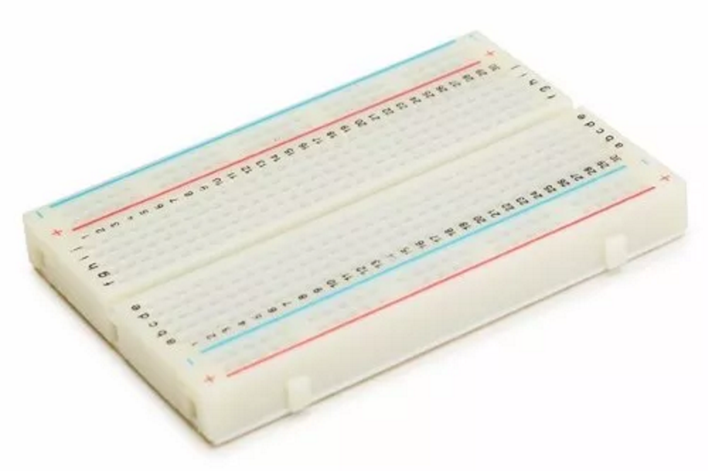
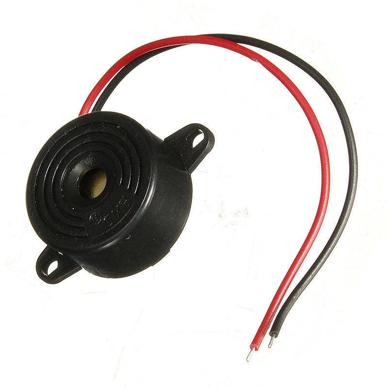
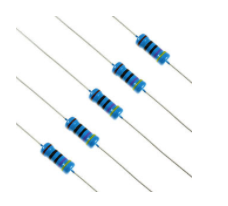
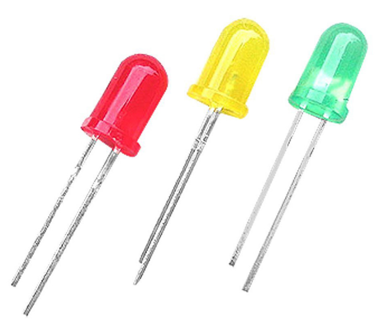
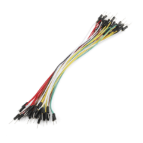
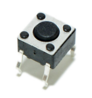

# Appendix

## Breadboard

These are great units for making temporary circuits and prototyping when you need prototype a circuit quickly and temporarily.

Breadboard are boards that can simulate electronic component connections and since they are not permanent, it is easy to remove a component if you make a mistake, or just start over and do a new project.

## Piezo

Piezo is a sensor that emits a beep, such as a horn. This signal can be created in an application Nodebots from a numeric value or an abstraction of sound/music notes, which makes their manipulation simpler. 

Typical uses of buzzers include alarm devices, timers, and confirmation of user input such as a mouse click or keystroke.

## Resistors

The resistors are widely used in electronics as one of the first electronic components that users have the first contact and one of the most used. They are small enough in pill form with stripes in most cases. Because resistance is an essential element of nearly every electronic circuit, you'll use them in just about every circuit that you build.

A resistor is an electronic component that limits the flow of electrons dissipating energy in the form of heat, since the electricity has to struggle to flow through something with a high resistance. It uses a large amount of energy and converting it into heat.

## LED (Light-emitting diode)

LED is an abbreviation for LED (Light-emitting diode), a semiconductor device that converts electricity into light.

## Sensors

A device that converts real-world (analog) data into data that a computer can understand using ADC and converting data from Analog to Digital format. We will use sensors to detect events or environment changes and we will send it for you to read in our application.

## Protective Conductor (Ground or Ground Wire)

It is the input wire of an electric conductor that has the function of "grounding" all the devices that need to use its potential as a reference or its electrical properties.

In power systems, the grount connector has the functions of electrical reference for voltage, protection systems, control for overload/power and equipment protection.

## Jumper Wires

It is a short insulated wire with bare (stripped of insulation) ends. You use them to connect two points in a breadboard circuit.

## Push Button

It is a simple switch mechanism for controlling some aspect of a machine or a process.

