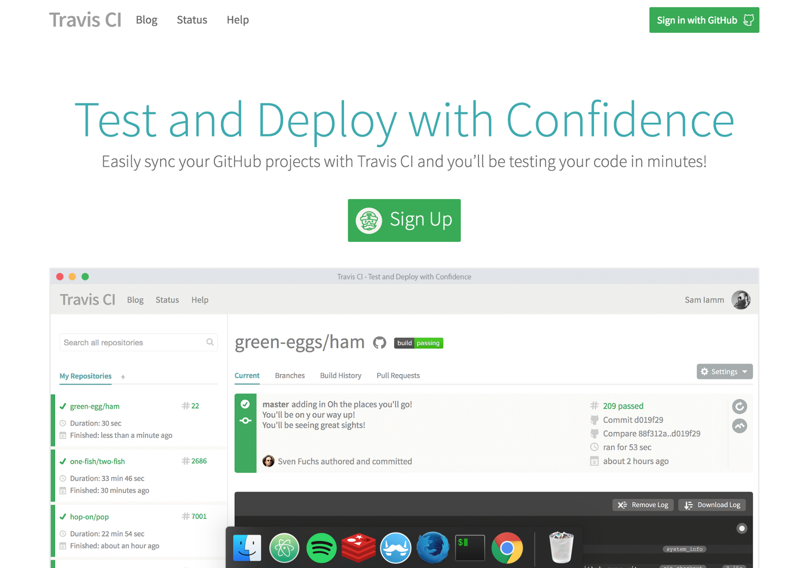
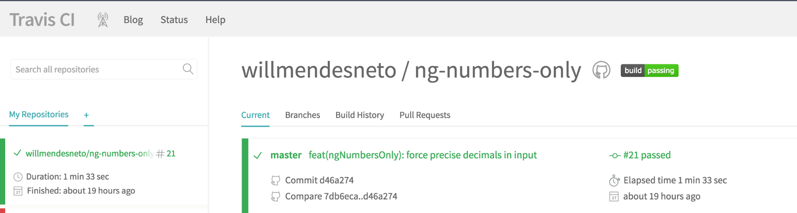
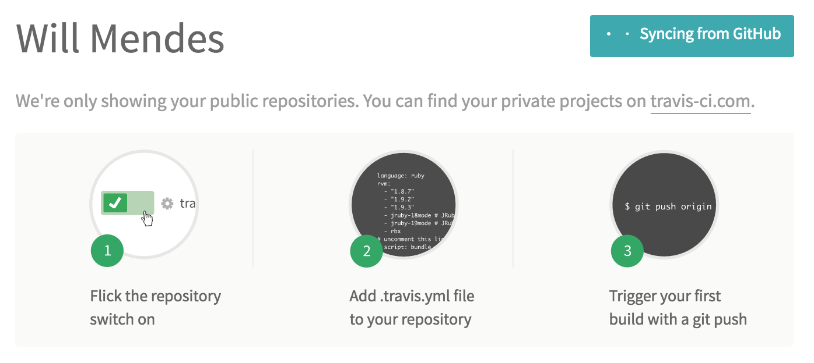

# Supporting Your Code on Multiple Operating Systems

In this stage of the book we will then validate and verify the coverage of tests in our project on different operating systems, as well as enable different web services for workflow improvements, such as continuous integration tools and code coverage.

This step is very important because these tools help us in the security process of our code, checking different criteria of acceptance of our application in an automated way.


## Adding Continuous Integration Servers to Your Project


Like all quality projects, our Nodebots project will be concerned with some other aspects, such as automating the test suite, build and other tasks relevant to our project.


For this we will rely on the help of a continuous integration server. There are several in the market, being free or paid, and in this stage of the book we will know a little more about the operation and configuration of two of them: Travis-CI and Appveyor.


### Travis-CI: Checking Your Code on Linux and OSX

Knowing that currently the most used operating systems are Unix/Linux, Windows and OSX we will create checks for each of them and for this the Travis-CI comes into play.


It is one of the most famous services of [continuous integration](http://blog.caelum.com.br/integracao-continua/) and assists in the process of integrating the new features or bug fixes of the code of the current project in several Environments, and can even deploy for production if all the validation steps are correct.


Let's go to the official project site [travis-ci](https://travis-ci.org/) and enable access using our Github account. Click on the *"Sign up"* button and enable access to your repositories.



After this step you will be redirected to a new page with all your repositories. To add a new one just click on the "+" icon next to the text *"My Repositories"*.



After this step you will be redirected to a new page with all your repositories. To add a new one just click on the "+" icon next to the text "My Repositories".

This next step is very simple since the page has a tutorial showing each of the steps to enable the integration of Travis-CI with its repository in Github, as we can see in the image below.



On the same page, all your repositories will be listed so you can choose and enable Travis-CI integration with your project. To enable it, just click the gray button with an "X" and when it changes color to green it means that everything went as expected and its repository is synchronized with Travis-CI.

Travis-CI is fully configurable and you can add information from a wide range of commands, from commands to be invoked before, during or after the build, and even configure the types of operating systems that the tasks should take place.

These settings will be in the `.travis.yml` file that will be in the root folder of our project. Let's explain a bit more about configuring these tasks in Travis-CI.


First, in the `.travis.yml` file, we will add the` `as well as` `field, with the appropriate information of the operating systems used for our tests.
```
...
os:
  - linux
  - osx
...
```

We will also add the `"node_js"` field, which will be our information about the NodeJS versions that the tasks should be used in our tasks. In our case we will only add one version, but we could add several others based on our support needs, for example.

```
...
node_js:
  - '5.3.0'
...
```

Our continuous integration server is nothing more than a container with a complete operating system. So we can also configure environment variables in it. In this case we will add the variable `NO_SERIALPORT_INSTALL`, specifying that we should not install the 'serialport' package in this case, because it is a test that uses a` mock` of a physical board.


NOTE: The idea of this book is to focus on the concepts directly related to Nodebots and integrations with the javascript repository created, so I will not explain about the concept of `containers`. If you want to know more about this concept used by Travis-CI, visit the [official Docker project website](https://www.docker.com).
```
...
env:
  - NO_SERIALPORT_INSTALL=1
...
```

We can also define the set of tasks that will be used before and after our travis script. In this case we will use `before` for the commands that must occur before our main script and` after` for the commands that must occur after the travis commands, as you can see in the following code snippet:

```
...
before_script:
  - 'npm install'


after_script:
  - 'make test'
...
```

In this case we are installing our dependencies and running our tests. All this in a very simple and well defined way. The contents of our `.travis.yml` file with all the changes will be as follows:

```
language: node_js
os:
  - linux
  - osx
node_js:
  - '5.3.0'
before_script:
  - 'npm install'


after_script:
  - 'make test'
env:
  - NO_SERIALPORT_INSTALL=1
```

We can see that the Travis-CI build is a bit different now, since we are running the same setup on Linux and OSX operating systems, identified by the icons of each operating system.


With the integration tested, let's then put the travis-ci badge in our `README.md` file in the repository. With this you will see an image with the status of the build.

```
[](https://travis-ci.org/willmendesneto/build-checker)
```

With this we have finished our integration with Travis-CI continuous integration server and we have our entire suite of tests running on Linux and OSX systems. In this next step we will configure the same tasks, but to be verified in the Windows operating system, using another continuous integration server called Appveyor.
