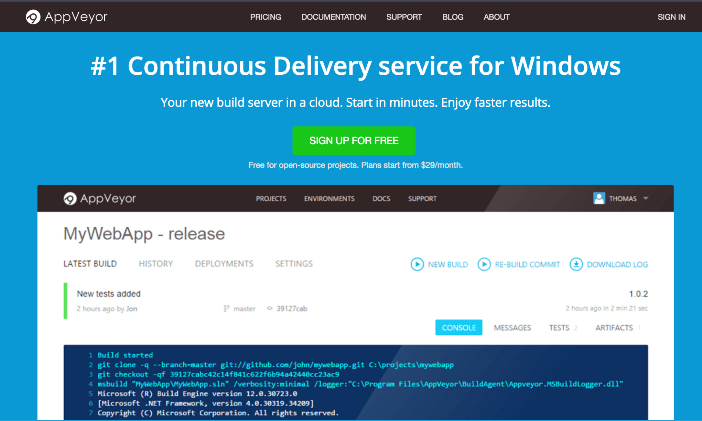
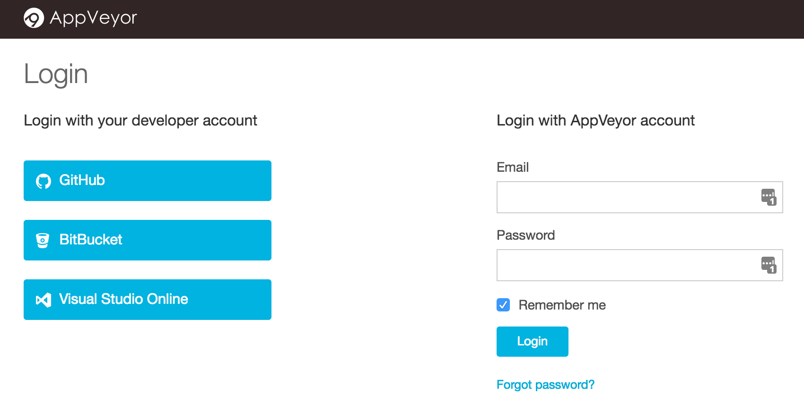
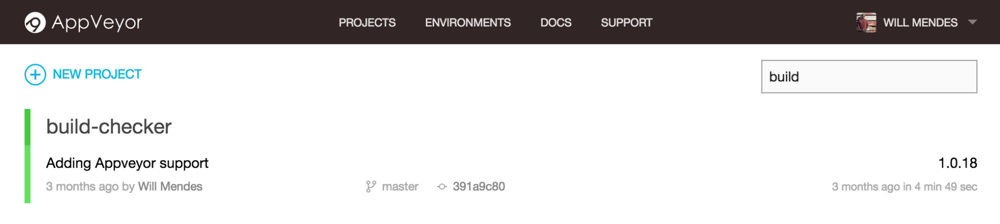
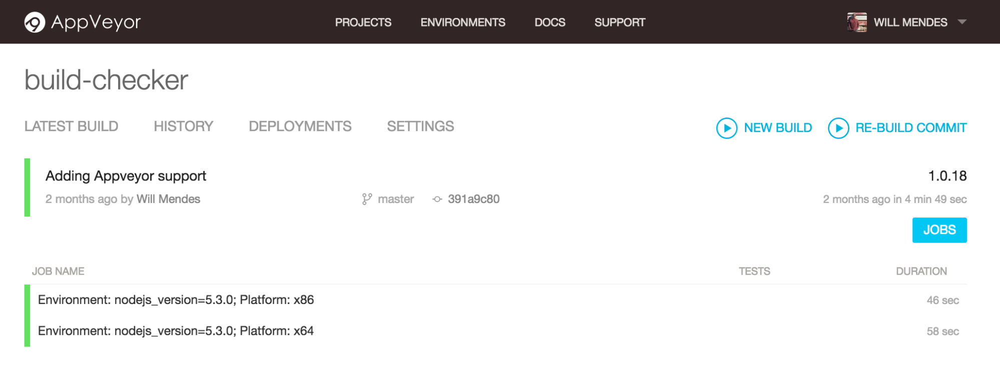
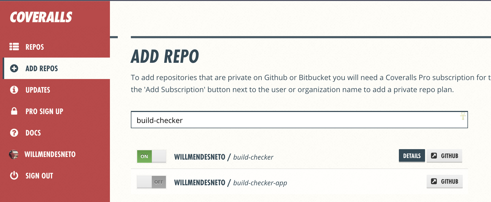
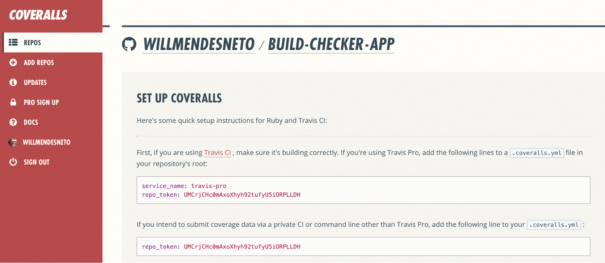
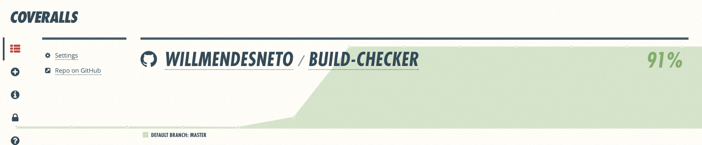
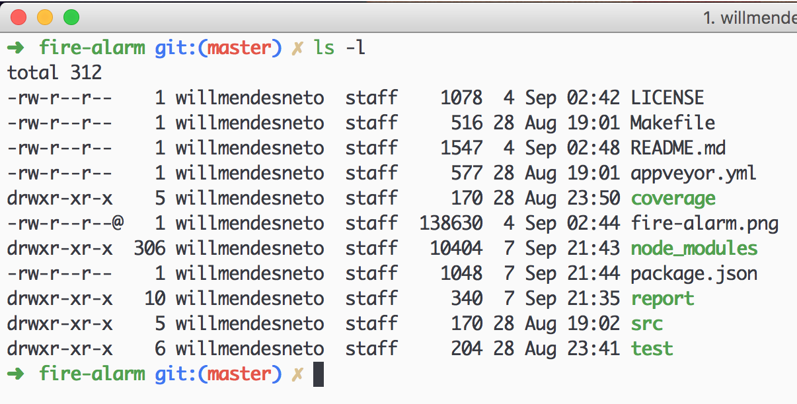
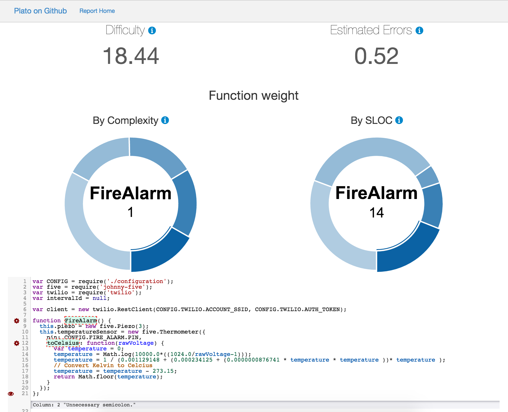

# Supporting Your Code on Multiple Operating Systems

In this stage of the book, we will then validate and verify the coverage of tests in our project on different operating systems, as well as enable different web services for workflow improvements, such as continuous integration tools and code coverage.

This step is very important because these tools help us in the security process of our code, checking different criteria of acceptance of our application in an automated way.


## Adding Continuous Integration Servers to Your Project


Like all quality projects, our Nodebots project will be concerned with some other aspects, such as automating the test suite, build and other tasks relevant to our project.

For this, we will rely on the help of a continuous integration server. There are several in the market, being free or paid, and in this stage of the book, we will know a little more about the operation and configuration of two of them: Travis-CI and Appveyor.


### Travis-CI: Checking Your Code on Linux and OSX

Knowing that currently, the most used operating systems are Unix/Linux, Windows and OSX we will create checks for each of them and for this the Travis-CI comes into play.

It is one of the most famous services of [continuous integration](http://blog.caelum.com.br/integracao-continua/) and assists in the process of integrating the new features or bug fixes of the code of the current project in several Environments, and can even deploy for production if all the validation steps are correct.


Let's go to the official project site [travis-ci](https://travis-ci.org/) and enable access using our Github account. Click on the *"Sign up"* button and enable access to your repositories.


After this step, you will be redirected to a new page with all your repositories. To add a new one just click on the "+" icon next to the text *"My Repositories"*.


Now, you will be redirected to a new page with all your repositories. To add a new one just click on the "+" icon next to the text "My Repositories".

This next step is very simple since the page has a tutorial showing each of the steps to enable the integration of Travis-CI with its repository in Github, as we can see in the image below.


On the same page, all your repositories will be listed so you can choose and enable Travis-CI integration with your project. To enable it, just click the grey button with an "X" and when it changes colour to green it means that everything went as expected and its repository is synchronised with Travis-CI.

Travis-CI is fully configurable and you can add information from a wide range of commands, from commands to be invoked before, during or after the build, and even configure the types of operating systems that the tasks should take place.

These settings will be in the `.travis.yml` file that will be in the root folder of our project. Let's explain a bit more about configuring these tasks in Travis-CI.


First, in the `.travis.yml` file, we will add the `os` field, with the appropriate information of the operating systems used for our tests.

```
...
os:
  - linux
  - osx
...
```

We will also add the `"node_js"` field, which will be our information about the NodeJS versions that the tasks should be used in our tasks. In our case, we will only add one version, but we could add several others based on our support needs, for example.

```
...
node_js:
  - '5.3.0'
...
```

Our continuous integration server is nothing more than a container with a complete operating system. So we can also configure environment variables in it. In this case, we will add the variable `NO_SERIALPORT_INSTALL`, specifying that we should not install the 'serialport' package in this case because it is a test that uses a` mock` of a physical board.

NOTE: The idea of this book is to focus on the concepts directly related to Nodebots and integrations with the javascript repository created, so I will not explain the concept of `containers`. If you want to know more about this concept used by Travis-CI, visit the [official Docker project website](https://www.docker.com).

```
...
env:
  - NO_SERIALPORT_INSTALL=1
...
```

We can also define the set of tasks that will be used before and after our Travis script. In this case, we will use `before` for the commands that must occur before our main script and` after` for the commands that must occur after the Travis commands, as you can see in the following code snippet:

```
...
before_script:
  - 'npm install'


after_script:
  - 'make test'
...
```

In this case, we are installing our dependencies and running our tests. All this in a very simple and well-defined way. The contents of our `.travis.yml` file with all the changes will be as follows:

```
language: node_js
os:
  - linux
  - osx
node_js:
  - '5.3.0'
before_script:
  - 'npm install'


after_script:
  - 'make test'
env:
  - NO_SERIALPORT_INSTALL=1
```

We can see that the Travis-CI build is a bit different now since we are running the same setup on Linux and OSX operating systems, identified by the icons of each operating system.


With the integration tested, let's then put the Travis-ci badge in our `README.md` file in the repository. With this, you will see an image with the status of the build.

```
[](https://travis-ci.org/willmendesneto/build-checker)
```

With this, we have finished our integration with Travis-CI continuous integration server and we have our entire suite of tests running on Linux and OSX systems. In this next step we will configure the same tasks, but to be verified by the Windows operating system, using another continuous integration server called Appveyor.


### Appveyor: Checking Your Code on Windows

Many projects are developed on Unix-based operating systems by default and adding support for Windows was considered a big challenge for some, since building a Windows test environment was not trivial, requiring the purchase of software licenses.

The continuous integration service [Appveyor](https://www.appveyor.com/) is one of the solutions used for testing projects hosted on GitHub in Windows environments, facilitating this process and ensuring that our code is [cross- Platform](https://en.wikipedia.org/wiki/Cross-platform), running on major operating systems.

Adding Appveyor support to our project is a fairly simple task. We will then visit the official website of the project and create a login with our information.



On the login page, we have some options listed with support for some of the major code repositories on the internet. In this option we will use Github, to facilitate the next steps, but it is worth remembering that you can use any of the options supported for *login*.



With your user created and your access working, the main page after login is a page listing all of your repositories based on a category located on the left side of the site. In our case, we will choose the `build-checker` project and click on the 'Add' button to add the support to our project.

We will then see the page of our project with the information specific to it, currently.



Now that we have our project configured we will create our `appveyor.yml` file, where our test settings will be. This file is very similar to Travis-CI in some ways.

The contents of our `appveyor.yml` file with all the changes will be as follows:

We will add the version of NodeJS used in the environment field of our configuration file.

```
...
environment:
  matrix:
    - nodejs_version: "5.3.0"
...
```

The platform field will be used to describe the platforms used. Note that in this case instead of having the differentiation between operating systems, we have between operating system platforms (x86 and 64x).

This is also interesting if there is a need to have a notion of the difference in performance, performance and other aspects of the same application on different platforms.

```
...
platform:
  - x86
  - x64
...
```

The install field will list our initial commands. Note that ps is a command to install NodeJS with the one specified in the file.

After this step we cleared the cache using the npm cache clean command for security measure in order to avoid possible false positives in our tests and, after completing this command, we will then install our dependencies using the npm install command.

```
...
install:
  - ps: Install-Product node $env:nodejs_version
  - npm cache clean
  - npm install
...
```

The test_script field will have the list of our commands to execute at the time of running our tests. We are directly accessing the node_modules folder and invoking the tests from them with the `node_modules/.bin/Istanbul cover node_modules/mocha/bin/_mocha -- -R dot` command, because we use the make test command in our `npm test`.

```
...
test_script:
   Run the test
  - cmd: node_modules/.bin/istanbul cover node_modules/mocha/bin/_mocha -- -R dot
```

As our case does not require the creation of a build, we will add the information in our file with the `off` value and we will configure our build to be finalised as soon as possible by adding the `fast_finish` field with the value `true`.

```
build: off
matrix:
  fast_finish: true
...
```

The final content of our `appveyor.yml` file with all changes will be as follows:

```
 Fix line endings on Windows
init:
  - git config --global core.autocrlf true
environment:
  matrix:
    - nodejs_version: "5.3.0"
platform:
  - x86
  - x64
install:
  - ps: Install-Product node $env:nodejs_version
  - npm cache clean
  - npm install
test_script:
   Run the test
  - cmd: node_modules/.bin/istanbul cover node_modules/mocha/bin/_mocha -- -R dot
build: off
matrix:
  fast_finish: true
```

Notice that in this case, we have the list of our differentiated build by platforms on the listing page.



With the new integration tested, we will then update the README.md file from the repository with the Appveyor badge. With this, you will see an image with the status of the build, as well as what we have inserted previously.


```
[](https://ci.appveyor.com/project/<nome-do-seu-usuario-ou-organização>/<nome-do-seu-repositório>/branch/master)
```

Notice that we have two tags in this code snippet. Replace this information as follows:

- `<your-user-or-organisation-name>`: name of your user or organisation;
- `<your-repository-name>`: name of your repository;

For example, based on the example repository, our badge will have the following content.

```
[](https://ci.appveyor.com/project/willmendesneto/build-checker/branch/master)
```

As you might realise adding support for multiple operating systems and platforms is quite a simple task with Appveyor. The next steps in the book will be more focused on improving the automation of checking our code coverage.


## Code coverage for your code

Once our repository is communicated with continuous integration services, we will now add new tools. This time the focus is on the coverage of our code, checking if everything is being properly validated in an automated way even before we continue with the other development stages of our Nodebots.


### Checking the code coverage of our project: Getting to know Istanbul


[Istanbul](http://gotwarlost.github.io/istanbul) is a NodeJS package for verifying code coverage in our repository using various parameters such as code-line coverage, functions, declarations, and [reverse engineering]( Https://en.wikipedia.org/wiki/Reverse engineering).

Let's then add this package to our project using the following command.

```bash
$ npm install --save-dev istanbul
```

To verify that it is integrated into our repository, simply type in our prompt/command line.

```bash
$ ./node_modules/.bin/istanbul help
```


As we previously integrated [MochaJS](https://mochajs.org/) into our repository when we created the project tests, we can simply type the following command at our command prompt.

```bash
$ ./node_modules/.bin/istanbul cover ./node_modules/.bin/_mocha
```

The return will be the same as the image below. You may notice that we now have some new information in the footer of test messages, such as percentages of rows, functions, branches, and declarations of methods, classes, or objects.


Notice that we now have a new folder called coverage with some files and all this information listed in our command line. We will use them in the next steps for integration with the Coveralls service.


### Integrating Continuous Integration Server with Coveralls

With the code coverage information collected, we will then integrate a new service called [coveralls](https://coveralls.io/). It will be used to integrate code coverage data and make it visible by adding a badge in our `README.md`.


The login is very simple and you will have to enable integration with your Github. After this step, you will see a list with all your repositories registered in Github. Click the button to the left of your listed repository and wait for the message `"Off"` to become `"On"`.



Note that with the repository enabled, we now have a link to the details page. By clicking this link we will be directed to a page with all the initial information for the project setup in coveralls. For our solution, we will use the option to add coveralls information to the `.coveralls.yml` file.



We will then copy this content from the file option on the setup page and create the new file in our project. Within our local repository, we will type the following command via prompt/command line.

```bash
$ touch .coveralls.yml
```

We will open this file in our editor and we will add the content to this file. After this step, we will add the NodeJS package to our list of development dependencies to integrate the coveralls infrastructure into our project by typing the following command.

```bash
$ npm install --save-dev coveralls
```

Once we submit a new code, we can see that we have the percentage of code coverage information visible on the coveralls website in the area of our repository. With this we can follow all variations of code coverage, we create validations and more.



After that, we can add a new badge with the code coverage information for our project in the `README.md` the file contained in the project repository. The badge pattern is quite simple:

```
[](https://coveralls.io/r/<nome-do-seu-usuario-ou-organização>/<nome-do-seu-repositório>?branch=master)
```

Notice that we have two tags in this code snippet. Replace this information as follows:

- `<your-user-or-organisation-name>`: name of your user or organisation;
- `<your-repository-name>`: name of your repository;

For example, based on the example repository, our badge will have the following content.

```
[](https://coveralls.io/r/willmendesneto/build-checker?branch=master)
```

After adding and saving this code, the final result to be rendered will be something similar to the following image.


And with this, we conclude our integration with the coveralls service. This is just a simple example of one of the many features of this service and I strongly recommend that you read the [coveralls documentation](https://coveralls.zendesk.com/hc/en-us) so that you have a greater This service.


### Checking code complexity with PlatoJS

PlatoJS is a NodeJS package that will help us in some validations of our nodebots code. It creates a report using some data generated through static analysis of the code of our project that shows us some information such as code complexity, maintenance difficulty, lines of code, possible implementation errors, among other relevant data.


> If you would like to know more about PlatoJS, please visit the repository in the [Github of the project](https://github.com/es-analysis/plato)

Its installation is very easy. Just type the command:

```bash
$ npm install --save-dev plato
```

And after this step, the plato was installed locally as a development dependency in our `node_modules` folder of our project. Our next step is to add a new NPM command. Now we will have the `code-analysis` command that will trigger the plate to our project.

```json
{
  ...
  "scripts": {
    "start": "nodemon ./src/index.js -e js,json --watch ./src",
    "test": "make test",
    "code-analysis": "plato -r -d report src test"
  },
  ...
}
```

And to trigger the PlatoJS, just type:

```bash
$ npm run code-analysis
```

And after this command will be created a folder of name `report` with the information of the analysis of our repository.



Within this folder, we will have several files with the information returned from the PlatoJS analysis that we can see more details by accessing the `index.html` file in our browser.

This page will have information on each file and graphs showing data such as level of complexity and lines of code, as we can see in the figure below.


