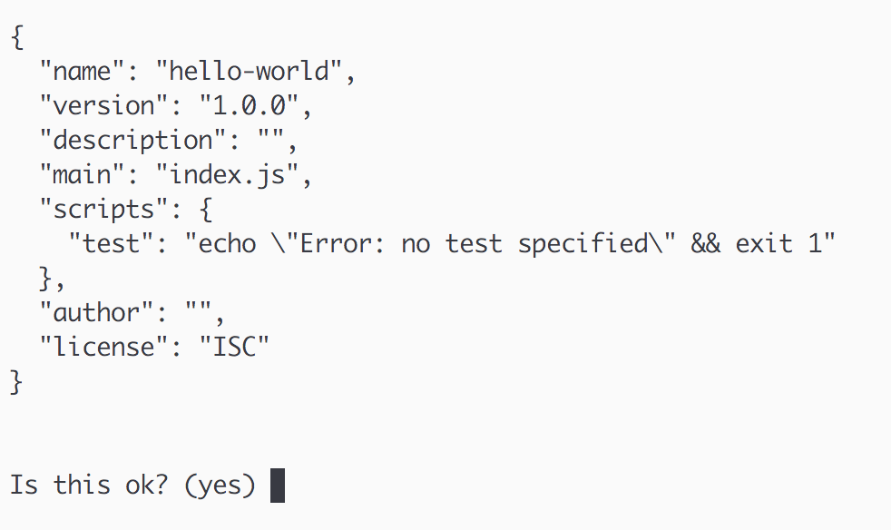
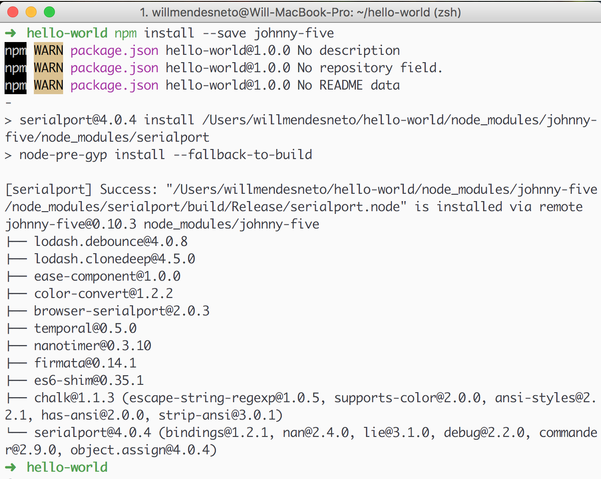
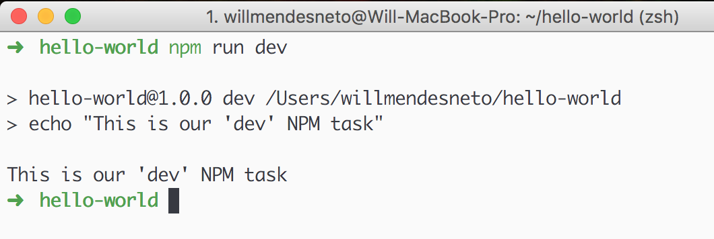
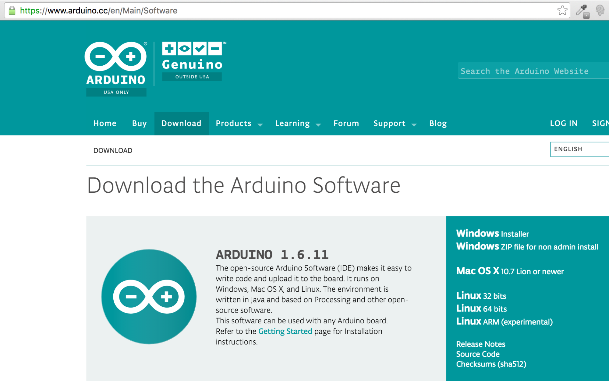
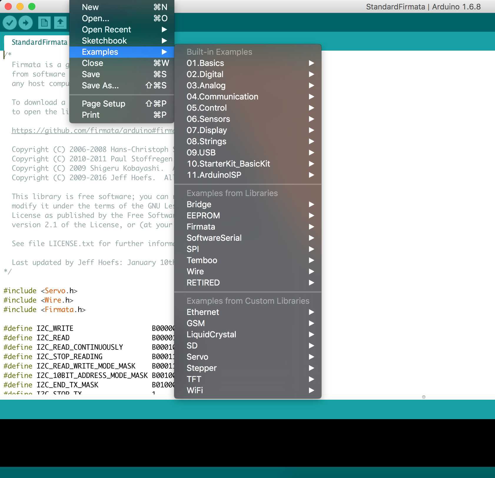
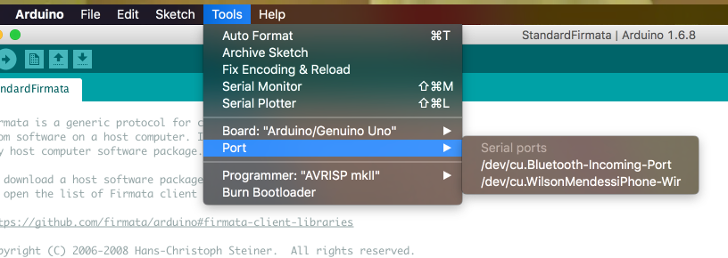

# Nodebots e microcontroladores

## O que são nodebots?

NodeBots é um termo utilizado para definir o conceito de controle sobre open hardware, um hardware eletrônico projetado e oferecido da mesma maneira e com as mesmas licenças que um software de código livre, sensores e outros componentes eletrônicos utilizando NodeJS. E você pode utilizar vários elementos: desde sensores, [servo motores](https://pt.wikipedia.org/wiki/Servomotor), rodas, detectores de movimento, câmeras, displays de LED, reprodutores de áudio e muito mais.

Em alguns momentos o conceito de Nodebots está diretamente conectado ao conceito de IoT - Internet das Coisas. Do inglês *Internet of Things* é uma revolução tecnológica a fim de conectar aparelhos eletrônicos do nosso cotidiano, como aparelhos eletrodomésticos e até mesmo máquinas industriais e aparelhos com acesso à internet e outras inovações técnicas em campos importantes como o da automação domiciliar a partir de sensores.

Toda a ideia de NodeBots evoluiu de acordo com as capacidades crescentes no NodeJS e o esforço de alguns desenvolvedores como Nikolai Onken, Jörn Zaefferer, Chris Williams, Julian Gautier e Rick Waldron que trabalharam para desenvolver os vários módulos que usamos em aplicações NodeBots hoje em dia. O módulo [node-serialport](https://www.npmjs.com/package/serialport), criado por Chris Williams, foi o pontapé inicial pois permite o acesso a dispositivos utilizando processos de leitura e escrita a portas seriais em baixo nível.

Julian Gautier, em seguida, implementou o [Firmata](https://www.npmjs.com/package/firmata), um protocolo usado para acesso a microcontroladores, como Arduinos, via código usando JavaScript para a comunicação entre componentes físicos.

Rick Waldron foi um pouco mais além. Usando a biblioteca Firmata como base, ele criou um framework para auxiliar na construção de Nodebots e Internet das coisas chamado Johnny-Five.

O framework Johnny-Five torna o controle de vários componentes, desde LEDs até vários outros tipos de sensores de uma maneira simples e prática. Isto é o que muitos NodeBots agora usam para atingir alguns feitos impressionantes!


## Microcontroladores

Quando falamos de nodebots, estamos indiretamente mencionando microcontroladores. Um microcontrolador é um computador menor e mais simples. Ele possui uma placa programável simples de circuito físico (citaremos como pinos, entradas, etc) que pode detectar várias entradas e saídas.


Um Arduino é um dos vários tipos de microcontroladores, sendo um dos mais comuns para experimentos e validações entre software e hardware. Existem outros tipos de microcontroladores, também, que pode ser alimentado por Node incluindo:

- [Raspberry Pi](https://www.raspberrypi.org/);
- [Tessel](https://tessel.io/);
- [Espruino](http://www.espruino.com/);
- [BeagleBone](http://beagleboard.org/bone);

Neste livro utilizarei o [Arduino UNO](https://www.arduino.cc/en/Main/ArduinoBoardUno) nos exemplos, mas sinta-se livre para utilizar o microcontrolador de sua escolha.

## NodeJS

NodeJS é um *runtime* de execução JavaScript construído com base na *engine* Javascript V8 do Chrome, possibilitando a utilização do Javascript em outros ambientes além da web e com um aspecto importante que é a utilização de um modelo não-bloqueante de entrada e saída de dados orientado a eventos. Possui o objetivo de ajudar programadores na criação de aplicações de alta escalabilidade como servidores web com conexões simultâneas, scripts assíncronos e até mesmo a integração com componentes eletrônicos que é o nosso caso.

Foi criado por Ryan Dahl em 2009, e seu desenvolvimento é mantido pela comunidade e pela Node Foundation, da qual empresas como IBM, Google, Red Hat, Joyent, dentre outras.


### Instalando no Windows

Instalar o NodeJS no Windows é bem simples. Uma das maneiras é visitar o [website oficial do projeto](https://nodejs.org/en/download/) e baixar o instalador no formato, clicar nas opções de instalação e finalizar a instalação. Quando finalizar abra o seu prompt de comando acessando pelo prompt de comando do Windows a partir do comando "Executar > cmd" e, após iniciar o programa, digite o seguinte comando:

```bash
$ node -v
```

Ele deve exibir no prompt a versão atual do NodeJS no seu terminal. Com isso finalizamos a instalação no ambiente Windows.


### Instalando no Linux e Mac OS X

Para os sistemas Linux e Mac OS X você pode utilizar vários formatos como efetuar o download do node no site (como fizemos para a instalação no Windows), via gerenciador de pacotes do próprio sistema operacional, mas uma forma de unificar o formato de instalação para as plataformas é utilizar o [NVM - Node Version Manager](https://github.com/creationix/nvm) que é um gerenciador de versões do NodeJS baseado em bash script.

Sua instalação é bem simples. Você pode instalar localmente via Curl ou Wget, respectivamente:

Curl:

```bash
$ curl -o- https://raw.githubusercontent.com/creationix/nvm/v0.31.6/install.sh | bash
```

Wget:

```bash
$ wget -qO- https://raw.githubusercontent.com/creationix/nvm/v0.31.6/install.sh | bash
```

> Pacotes como CURL e WGET podem não estar instalados em seu sistema operacional por padrão. Caso precise, verifique a melhor forma de instalação para o seu sistema operacional ou acesse o repositório do NVM no Github para verificar os passos de instalação ou possíveis soluções de problema.


Logo a seguir, você deve abrir o seu arquivo que guarda a configuração padrão de seu terminal, que pode estar localizado no `~/.bash_profile`, `~/.zshrc`, `~/.profile` ou `~/.bashrc`, e adicionar estas linhas no final deste arquivo de configuração para que carregue o NVM no momento em que você acesse a linha de comando.

```bash
export NVM_DIR="$HOME/.nvm"
[ -s "$NVM_DIR/nvm.sh" ] && . "$NVM_DIR/nvm.sh" # This loads nvm
```

Com isso, assim que você recarregar o seu terminal o NVM estará disponível. Agora basta instalar a versão do NodeJS de sua preferência. Neste livro utilizaremos a versão 5.3.0.


```bash
$ nvm install 5.3.0
$ nvm use 5.3.0
$ nvm alias default 5.3.0
```

Após estes comandos o NVM fará o download da versão específica do NodeJS, deixando-a acessível via terminal. Para verificar se o comando foi concluído com sucesso, digite o comando:

```bash
$ node -v
```

O resultado deve ser `v5.3.0`. Se este foi o retorno do seu comando, está tudo pronto para os nossos próximos passos. Caso tenha algum problema verifique se o código de carregamento do NVM foi inserido no arquivo de configuração do seu terminal e inicie outra instância do seu terminal.


Foi criado um arquivo com os comandos contidos neste tópico para a instalação do NVM e o Node com a versão utilizada neste livro. Caso queira utilizá-lo, por favor faça o [download do arquivo nvm-install.sh](https://gist.github.com/willmendesneto/4c951413bacbb8850837a53bcdada30d).


## Gerenciando dependências com o NPM

### Iniciando o seu projeto e conhecendo o arquivo package.json

Como primeiro passo vamos criar a pasta "hello-world" e adicionaremos informações iniciais para nosso projeto. Para isso usaremos o comando [npm init](https://docs.npmjs.com/cli/init).


Para continuar será necessário responder a algumas perguntas básicas sobre o projeto, tais como:
- Nome do pacote;
- Versão do projeto;
- Descrição sobre o projeto;
- Nome do arquivo principal do projeto. Este será produzido no final do seu projeto, depois de todos os tratamentos de minificação, obfuscação e outros procedimentos de otimização do seu código javascript;


Pode ficar tranquilo que nenhuma delas é obrigatória. Caso não saiba ou não queira responder agora, basta clicar na tecla "Enter" até o final. Em seguida, ele vai criar um arquivo `package.json` com estas informações do seu repositório.



### Adicionando pacotes

Agora que já temos o nosso [package.json](https://docs.npmjs.com/files/package.json) com todas as configurações básicas do nosso repositório, vamos instalar o nosso primeiro pacote para integrarmos com o nosso projeto!

O NPM funciona como o gerenciador de pacotes oficial para aplicações NodeJS, sendo o maior ecossistema de bibliotecas e módulos *open source* do mundo.

Com ele você pode adicionar pacotes em sua aplicação a partir do comando [npm install](https://docs.npmjs.com/cli/install) informando o nome do pacote publicado no site oficial do npm e o formato que queremos salvar o pacote na aplicação. Temos algumas opções de adição de pacotes que são:


- localmente como uma dependência de desenvolvimento: o pacote será instalado localmente e acessível na pasta `node_modules` e as informações do pacote serão salvas na chave `devDependencies` do seu arquivo JSON. Para usar esta opção adicione a flag `--save-dev`;
- localmente como uma dependência do seu projeto: o pacote será instalado localmente e acessível na pasta node_modules e as informações do pacote serão salvas na chave dependencies do seu arquivo JSON. Para usar esta opção adicione a flag `--save`;
- globalmente: o pacote será instalado com escopo global e acessível em qualquer outro projeto. Para usar esta opção adicione a flag `--global`;

> Pacotes salvos como dependência de desenvolvimento e globalmente não serão utilizados quando você publicar o seu projeto, então utilize estas opções com cuidado.

Para o nosso projeto inicial vamos instalar o framework Johnny-Five como uma das dependências de desenvolvimento, rodando o comando:

```bash
$ npm install --save johnny-five
```



Você pode perceber que agora temos alguns arquivos novos na pasta do nosso projeto.

Primeiramente, foi criada a pasta `node_modules` e dentro dela temos o nosso pacote instalado com sucesso.


Outra novidade foi a adição das informações do nosso pacote no bloco de conteúdo dependencies no nosso arquivo package.json.


```json
{
  "name": "hello-world",
  "version": "1.0.0",
  "description": "",
  "main": "index.js",
  "scripts": {
    "test": "echo \"Error: no test specified\" && exit 1"
  },
  "author": "",
  "license": "ISC",
  "dependencies": {
    "johnny-five": "^0.10.0"
  }
}
```

> O npm possui vários outros comandos padrão que podemos utilizar em nossa aplicação. Caso queira saber mais sobre estes comandos, acesse a página sobre estes comandos na [documentação oficial do NPM](https://docs.npmjs.com/misc/scripts).


### Adicionando comandos NPM


O NPM é uma ferramenta muito interessante e bastante flexível, com a possibilidade de criar de comandos específicos executados a partir do `npm run seu-comando`.


No nosso exemplo vamos criar um comando de exemplo para rodarmos o nosso código. Vamos abrir o nosso package.json no nosso editor/IDE de preferência e adicionarmos o seguinte código:


```json
{
  "name": "hello-world",
  "version": "1.0.0",
  "description": "",
  "main": "index.js",
  "scripts": {
    "dev": "echo \"This is our 'dev' NPM task\"",
    "test": "echo \"Error: no test specified\" && exit 1"
  },
  "author": "",
  "license": "ISC",
  "dependencies": {
    "johnny-five": "^0.10.0"
  }
}
```

Notem que na linha 7, em negrito, adicionamos o nosso novo comando NPM através do campo "scripts" do JSON. Reparem que já tínhamos o comando "test" que é um comando padrão do npm e está na mesma área do nosso novo comando, pois esta é a área padrão para adicionarmos os comandos a serem executados pelo NPM.

Para rodarmos o comando, basta acessarmos o nosso terminal ou prompt de comando e digitarmos `npm run dev`. O resultado retornará da seguinte forma:



## Arduino

### Arduino...ardu-o-que?


Arduino é uma plataforma open-source baseada em um hardware de fácil utilização e integração com sensores a partir do software. Por tratar-se de uma plataforma totalmente maleável e aberta qualquer um pode utilizá-lo em projetos dos mais diversos como simples verificações de dados recebidos por sensores de luz, temperatura, umidade ou até mesmo automação domiciliar.

Dentre as suas vantagens encontramos:

- Custo: o valor de um Arduino é muito baixo. Atualmente o custo de um [Arduino UNO](https://www.arduino.cc/en/Main/ArduinoBoardUno) é algo em torno de R$50,00 e o [Arduino Nano](https://www.arduino.cc/en/Main/ArduinoBoardNano) custa entre R$ 15,00 a R$ 20,00, podendo ser mais ou menos de acordo com o modelo de sua escolha;
- `Cross-platform`: Arduino é compatível com todos os sistemas operacionais e plataformas;
- Simples: Não exige de quem vai manipulá-lo um vasto conhecimento em eletrônica. Basta ter uma noção básica de desenvolvimento e você já pode fazer coisas bem bacanas;


### Sobre Open source hardware

`Open source hardware` é um hardware eletrônico com a mesma cultura de um software de código livre. Este termo utilizado pela primeira vez com o intuito de refletir a ideia de informação aberta e pública quanto ao hardware, como diagramas, estruturas de produtos e dados de `layout` de uma placa de circuito impresso.

Com o crescimento dos dispositivos lógicos programáveis, o compartilhamento dos esquemas lógicos de forma aberta também se espalhou. Neste caso as especificações do hardware estão disponíveis para todos. Ou seja, você pode criar ou evoluir o seu hardware a partir daquele conteúdo sem nenhum problema.


### Instalando Arduino IDE

A instalação do Arduino IDE é bastante simples. Basta acessarmos o [site oficial do projeto](https://www.arduino.cc/en/Main/Software) e na página principal podemos encontrar todas as opções de download por sistema operacional. Verifique qual o seu sistema operacional e faça o download do instalador.



Existe [uma página na Wiki do projeto Arduino com soluções para os problemas mais comuns](https://github.com/arduino/Arduino/wiki/Building-Arduino), caso vocês tenham algum tipo de inconveniente com a instalação e primeiro setup do Arduino IDE.

### Setup inicial do Arduino

> É possível codificar utilizando o seu editor ou IDE preferido e iniciar esta etapa utilizando o pacote [interchange](https://github.com/johnny-five-io/nodebots-interchange). O intuito do conteúdo a seguir é facilitar o setup do arduino para desenvolvedores que estão tendo o primeiro contato com a plataforma Arduino.


Feita a instalação do Arduino IDE, vamos agora acessar o programa e verificar o seu funcionamento. Primeiramente percebemos que o Arduino IDE possui alguns exemplos integrados como um mediador e facilitador para quem nunca teve contato com a plataforma. Para verificar a lista completa de exemplos basta acessar a opção File > Examples.


Vale lembrar que os códigos de exemplo são escritos na [linguagem C](https://pt.wikipedia.org/wiki/C_(linguagem_de_programa%C3%A7%C3%A3o) e não em Javascript, mas nada impede de rodar o código exemplo em seu sistema operacional.



Vamos agora conectar a nossa placa Arduino ao nosso sistema operacional. Como já conectei anteriormente, o Arduino IDE já armazenou a configuração do meu Arduino, que aparece no item "Board: Arduino Genuino/UNO", mas na primeira utilização aparecerá na opção "Port", que possui a listagem completa das portas seriais de seu sistema operacional.



O nome aparecerá com o prefixo "/dev/cu." e possuirá o nome do Arduino, facilitando a integração. Escolha a porta na qual o seu Arduino está conectado e pronto: a conexão foi efetuada com sucesso.


## Firmata

Firmata é um protocolo para a comunicação com os microcontroladores de software em um computador (ou smartphone / tablet, etc). O protocolo pode ser implementado no firmware de qualquer arquitetura microcontrolador, bem como em qualquer pacote de software de computador.

O nosso próximo passo após a instalação do Arduino IDE é adicionarmos o protocolo Firmata no nosso Arduino. Vamos abrir o nosso Arduino IDE e acessar a opção Files > Examples > Firmata > StandardFirmata.


Com o Arduino plugado no nosso computador rodamos o código a seguir e aguardamos a mensagem da IDE de que tudo ocorreu com sucesso.


## Johnny Five

Johnny-Five é um framework open source que permite que você controle um micro-controladores e componentes utilizando funções muito similares as que seriam utilizadas se você estivesse programando apenas para a plataforma Arduino em si, porém utilizando JavaScript e implementando o protocolo Firmata para comunicação com o software no computador host.

Isso permite que você escreva um `firmware` personalizado sem ter que criar o seu próprio protocolo e objetos para o ambiente de programação que você está usando. Resumindo, Johnny-Five é um pacote node que irá permitir programar micro controladores utilizando JavaScript!


### Adicionando johnny Five no projeto


Como todo bom pacote NodeJS, adicionar o Johnny-five no projeto é uma tarefa bem simples. Para isto vamos utilizar o comando que já vimos anteriormente, o `npm install`, e instalaremos o johnny five localmente, salvando como dependência de desenvolvimento do projeto.

```bash
$ npm install --save johnny-five
```

Após este comando, o NPM vai criar a pasta node_modules e dentro dela teremos o nosso pacote  johnny-five instalado e acessível no contexto do nosso projeto.

Podemos verificar também que o nosso package.json foi alterado. Nele foram adicionadas as informações do nome do nosso pacote NodeJS e a versão instalada, como podemos ver no código a seguir.

```json
{
  "name": "hello-world",
  "version": "1.0.0",
  "description": "",
  "main": "index.js",
  "scripts": {
    "test": "echo \"Error: no test specified\" && exit 1"
  },
  "author": "",
  "license": "ISC",
  "dependencies": {
    "johnny-five": "^0.10.0"
  }
}
```


### Criando um Hello World

Agora que todo o setup do nosso projeto foi realizado, vamos criar o nosso código de exemplo, e nada melhor do que o bom e velho "Hello World", dando-lhe boas vindas ao mundo Nodebots.


Vamos criar um código simples. Primeiramente criaremos o arquivo `index.js` na raíz do nosso projeto e importaremos o pacote Johnny-five utilizando o comando require.

```javascript
...
var five = require('johnny-five');
...

```

Este comando faz a requisição do pacote, tornando-o acessível ao nosso projeto. Agora conheceremos a nossa primeira classe do Jonny Five: o Board.

A classe Board retorna para a aplicação um objeto que representa a própria placa física na eletrônica. Todos os objetos dispositivo dependem deste objeto para serem inicializados.

```javascript
...
var board = new five.Board();
...
```

O objeto board possui um método .on(), que é comumente usado em aplicações Javascript para criação de event handlers. Este método aceita 2 parâmetros:

- Nome do evento;
- função a ser executada quando o evento for acionado;


Neste exemplo chamaremos este método com a opção `ready`, que verifica quando o código já está acessando a placa física utilizada.

```javascript
...
board.on('ready', function() {
  console.log('Hello World!');
});
...
```

E o conteúdo final do nosso `index.js` ficou bem enxuto, como podem ver abaixo.

```javascript
var five = require('johnny-five');
var board = new five.Board();

board.on('ready', function() {
  console.log('Hello World!');
});
```

Agora podemos rodar o nosso código via linha de comando digitando o comando:

```javascript
$ node index.js
```

E o resultado retornado será a mensagem *"Hello World"*, como vocês podem ver na figura abaixo.


Caso queiram facilitar, podemos utilizar o npm start, um dos comandos NPM padrão que podemos criar no nosso package.json, tornando-o acessível via linha de comando.

```json
{
  "name": "hello-world",
  "version": "1.0.0",
  "description": "",
  "main": "index.js",
  "scripts": {
    "start": "node index.js",
    "dev": "echo \"This is our 'dev' NPM task\"",
    "test": "echo \"Error: no test specified\" && exit 1"
  },
  "author": "",
  "license": "ISC",
  "dependencies": {
    "johnny-five": "^0.10.0"
  }
}
```

Após adicionarmos o comando, basta digitarmos na linha de comando `npm start` e o resultado será a mesma mensagem do comando anterior.

Neste tópico vocês viram a integração entre o nosso código Javascript com o hardware. Nos próximos capítulos veremos mais exemplos mostrando de uma maneira simples e divertida como integrar Nodebots ao nosso cotidiano.
