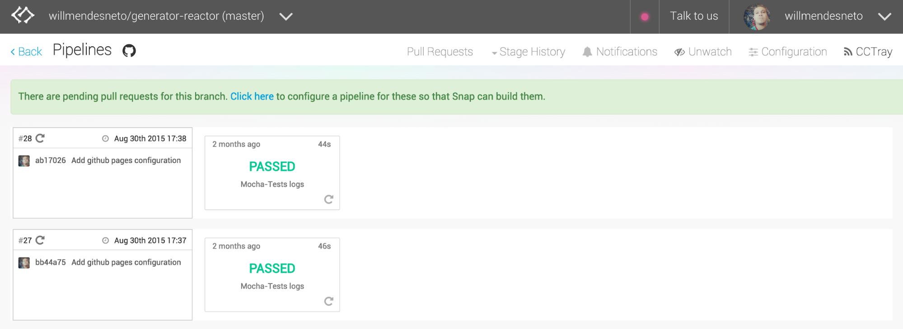

# Primeiro projeto: Build Checker

## O que é um build pipeline

Em algumas apresentações percebi que este termo não é conhecido por muitas pessoas, mesmo as que são mais familiarizadas com abordagens como integração contínua e entrega contínua.

Build pipeline é um conceito que foi construído em meados de 2005 e é baseado na ideia de paralelização de tarefas, separando cada etapa em pequenos critérios de aceitação para a aplicação. Vale lembrar que esses passos podem automáticos ou manuais.


## Criando um Build Checker

Sempre que começamos o contato com o Arduino, por exemplo, fazemos o exemplo de piscas as leds, comumente conhecido como blink.

Neste exemplo mostrarei uma forma mais atrativa de abordar este exemplo para o nosso cotidiano, baseado em modelos como [Hubot](https://hubot.github.com/) e [Retaliation](https://github.com/codedance/Retaliation) para checarmos a nossa build pipeline e averiguarmos a saúde de nossa aplicação utilizando Arduino + NodeJS + Johnny-Five em uma introdução a NodeBots.


## Anatomia de um verificador de build

O projeto foi baseado no [CCmenu](http://ccmenu.org/), projeto criado pelo ThoughtWorker Erik Doernenburg para checar e mostrar o status de um determinado projeto em um servidor de integração contínua.

No nosso caso passamos a idéia para algo físico, utilizando open hardware e NodeJS. Nossa aplicação consumirá um XML com as informações retornadas pelo Travis-CI. A partir destes dados checamos o estado atual da aplicação e o retornaremos utilizando alguns artifícios como Arduino e LEDs para avisar ao nosso time de que algo de errado aconteceu com o nosso build e devemos corrigir o quanto antes.


## Material necessário

Para este projeto utilizaremos:

- 1 Protoboard: Uma protoboard nada mais é que uma placa com furos e conexões condutoras para montagem de circuitos elétricos experimentais, sem a necessidade de soldagem. Um protoboard simples custa entre R$ 5,00 a R$ 10,00 e pode ser encontrado em qualquer loja de elétrica;
- 2 LEDS (*light-emitting diode*): 1 vermelha para sinalizar o build quebrado e 1 verde para sinalizar o que o build foi concluído com sucesso. Uma LED custa menos de R$ 0,50 e pode ser encontrada em qualquer loja de elétrica;
- Arduino com 2 portas GND (ground);


Portas GND são chamadas de portas "terra". São condutores elétricos que conectam-se à Terra - ou seja, ao Terra Elétrico. Uma vez que encontra-se sempre neutro e (teoricamente) presente em todo circuito elétrico, é sempre tomado como ponto de referência para a medida de potenciais, contendo zero volts.

Agora basta plugarmos as 2 LEDS, vinculando da seguinte forma:

- Build de sucesso na porta de número 12 + uma porta GND do nosso Arduino;
- Build de erro na porta de número 10 + uma porta GND do nosso Arduino;

A imagem a seguir ilustra a montagem dos componentes com o arduino.


### Controlando a LED


Conhecendo os componentes que utilizaremos, vamos agora ao nosso código inicial que vai controlar a nossa LED. Primeiramente criaremos a pasta `src`, onde ficará o código de nossa aplicação.

Vamos criar a pasta do nosso projeto `build-checker` e navegarmos para a pasta criada.

```bash
$ mkdir build-checker
$ cd build-checker
```

Iniciaremos a nossa aplicação digitando o comando `npm init` com a flag `-y` que significa que todas as respostas que foram feitas anteriormente serão respondidas e cadastradas com a resposta padrão. Após isto instalaremos o pacote johnny-five localmente como uma dependência na pasta do nosso projeto.

```bash
$ npm init -y
$ npm install --save johnny-five
```

Dentro da pasta do nosso projeto criaremos a pasta `src` e dentro dela o nosso arquivo `index.js`, onde ficará o nosso conteúdo.

```bash
$ mkdir src
$ touch src/index.js
```

No arquivo `index.js` e importaremos o pacote Johnny-five utilizando o comando `require` e criaremos a nossa instância de protoboard para adicionarmos o LED.

```javascript
...
var five = require('johnny-five');
var board = new five.Board();
...
```

Para a primeira atividade com o componente utilizaremos uma nova classe do Johnny Five chamada `LED`. Para utilizarmos esta classe precisamos passar o valor do pino que o `LED` está conectado ao Arduino.

```javascript
...
var led = new five.Led(12);
...
```

O nosso primeiro código funcional será mais ou menos desta forma.

```javascript
var five = require('johnny-five');
var board = new five.Board();

board.on('ready', function() {
  var ledSuccess = new five.Led(12);
  var ledError = new five.Led(10);

  ledSuccess.blink();
  ledError.blink();
});
```

Agora vamos colocar o nosso código para funcionar no nosso Arduino. Dentro da pasta do nosso projeto, vamos digitar no nosso prompt de comando/terminal o seguinte comando:

```bash
$ node src/index.js
```

Após este comando o nosso prompt/linha de comando está mostrando que o comando rodou com sucesso e o resultado será que as nossas duas LEDs estarão piscando.

Bastante simples, não é mesmo? No próximo tópico vamos pensar um pouco mais sobre a nossa arquitetura.


## Criando a requisição das informações de build no CI/CD

Já temos a nossa abstração do build checker, vamos agora adicionar a última funcionalidade que é a da leitura das informações de build no nosso servidor de entrega contínua e/ou servidor de integração contínua.

A partir daí criamos uma requisição para ler o conteúdo via GET no [SNAP-CI](https://snap-ci.com), o nosso serviço de integração contínua. O SNAP-CI utiliza um conceito de build pipeline que é bem interessante e um dos prós dele é o de feedback mais rápido, dando a possibilidade de paralelismo ou não, e definição de etapas para o build total. Para maiores informações sobre Build Pipeline recomendo a leitura do [artigo de Continuous Integration do Martin Fowler](http://www.martinfowler.com/articles/continuousIntegration.html).

Vamos no site do SNAP-CI, efetuamos o login e cadastramos um projeto. Caso não tenha cadastro você terá que criar um, mas é bem rápido.


Ao cadastrar o projeto ele vai aparecer na parte superior, à direita, um campo com o nome "CCTray" que, ao clicarmos, direciona para o arquivo XML com as informações do build.



E estas são as informações que consultaremos com nosso build-checker.

```xml
<Projects>
  <Project
name="brasil-de-fato/news-service (master) :: CONTRACT-TEST"
activity="Sleeping"
lastBuildLabel="77"
lastBuildStatus="Success"
lastBuildTime="2016-01-21T18:46:48Z"
webUrl="https://snap-ci.com/brasil-de-fato/news-service/branch/master/logs/defaultPipeline/77/CONTRACT-TEST"/>
</Projects>
```

Analisando as informações percebemos que a única informação que devemos validar para o nosso build são os dados do campo lastBuildStatus. Nele é retornado se o build foi finalizado com sucesso, finalizado com sucesso ou está acontecendo no momento da validação.

O campo `lastBuildStatus` pode conter:

- `Success`: a última tarefa no servidor foi finalizada com sucesso;
- `Failure`: a última tarefa no servidor foi finalizada com erro;
- `Pending`: a tarefa está acontecendo neste exato momento no servidor;
- `Exception` e `Unknown`: algo inesperado ocorreu com a atual tarefa no servidor. Os motivos são dos mais diversos, como o servidor teve uma oscilação no meio da tarefa ou ele nunca rodou uma determinada tarefa ainda, por isso não possui as informações;


Vamos agora adicionar a nossa URL que contém as informações do CCTray do nosso projeto e criar com a requisição destas informações. Para isso vamos adicionar o pacote NodeJS [request](https://github.com/request/request), um cliente HTTP que foi desenvolvido com o intuito de facilitar a criação de requisições HTTP ou HTTPS. Para adicionarmos o novo pacotes vamos digitar o seguinte comando.

```bash
$ npm install --save request
```

> A utilização do request é bem simples, aceitando 2 parâmetros sendo o primeiro a URL e o segundo a função que vai manipular a informação requisitada. Para maiores detalhes acesse a [documentação completa do pacote request no Github](https://github.com/request/request#table-of-contents).

Agora vamos adicionar o pacote no nosso projeto e criarmos a requisição usando o módulo RequestJS.

```javascript
...
var request = require('request');
var five = require('johnny-five');
var board = new five.Board();
...
```

E vamos adicionar o endereço co CCTray que copiamos do nosso servidor de integração contínua no nosso código e criaremos a requisição HTTP para leitura das informações.

```javascript
// Para fins didáticos este código está utilizando este formato
// Por questões de recurso computacional utilize a URL como string
// ao invés da manipulação do Array no projeto final
var CI_CCTRACKER_URL = [
  'https://snap-ci.com',
  'willmendesneto',
  'generator-reactor',
  'branch',
  'master',
  'cctray.xml'
].join('/');
```

Vamos explicar um pouco sobre o *callback* do RequestJS. Ele retorna 3 parâmetros:

- `error`: um objeto com as informações do erro que aconteceu. Caso a requisição não retorne nenhum erro ele possui o valor padrão `null`;
- `response`: objeto com as informações do response da requisição;
- `body`: String com as informações do body do retorno da requisição;

No nosso código então vamos analisar o retorno da requisição e criar os devidos tratamentos. O primeiro tratamento será a verificação do erro e, caso tenhamos um erro trataremos o erro.

```javascript
...
request(CI_CCTRACKER_URL, function(error, response, body) {
  if (error) {
    console.log('Something is wrong in our CI/CD =(');
    return;
  }
  ...
});
```

Caso o response não retorne nenhum erro, trataremos a mensagem para ligarmos e desligarmos as LEDs para o feedback visual.

```javascript
...
if(body.indexOf('Failure') !== -1) {
  console.log('Your CI/CD is broken! Fix it!!!!');
  ledSuccess.off();
  ledError.on();
} else {
  console.log('Your CI/CD is ok!');
  ledSuccess.on();
  ledError.off();
}
...
```

Com a requisição criada, vamos somente criar um intervalo entre cada requisição, utilizando um simples `setInterval`. Vamos utilizar um tempo de 500 milisegundos para validação do código, mas este valor pode ser alterado para o que for ideal ao seu caso.

```javascript
setInterval(function(){
  request(CI_CCTRACKER_URL, function(error, response, body) {
    ..
  });
}, 500);
```

E o conteúdo final do nosso `src/index.js` ficou da seguinte maneira:

```javascript
var request = require('request');
var five = require('johnny-five');
var board = new five.Board();

// Para fins didáticos este código está utilizando este formato
// Por questões de recurso computacional utilize a URL como string
// ao invés da manipulação do Array no projeto final
var CI_CCTRACKER_URL = [
  'https://snap-ci.com',
  'willmendesneto',
  'generator-reactor',
  'branch',
  'master',
  'cctray.xml'
].join('/');

board.on('ready', function() {

  var ledSuccess = new five.Led(12);
  var ledError = new five.Led(10);

  setInterval(function(){
    request(CI_CCTRACKER_URL, function(error, response, body) {
      if (error) {
        console.log('Something is wrong in our CI/CD =(');
        return;
      }

      if(body.indexOf('Failure') !== -1) {
        console.log('Your CI/CD is broken! Fix it!!!!');
        ledSuccess.off();
        ledError.on();
      } else {
        console.log('Your CI/CD is ok!');
        ledSuccess.on();
        ledError.off();
      }

    });
  }, 500);
});
```

Ele consultará os dados em um intervalo previamente configurado e verifica o estado atual do build, baseado nas informações de todas as pipelines. Caso não haja a palavra *"Failure"* no response da requisição, algo de errado aconteceu e o nosso *build checker* irá acender a luz vermelha, caso contrário a luz verde continua acesa, sinalizando que está tudo ok.


## Ajustando a arquitetura de nossa aplicação

Agora que finalizamos a primeira etapa e vimos o nosso funcionando com os nossos componentes, vamos pensar em melhorar a nossa arquitetura.

Podemos ver que temos alguns valores meio que soltos, que não dizem muita coisa se não acessamos a documentação do framework Johnny Five, tais como os números 12 e 10. Para estas e outras configurações vamos criar um arquivo de nome `configuration.js` com todas as informações do projeto.

O conteúdo inicial deste ficará arquivo será:

```javascript
// src/configuration.js
module.exports = {
  LED: {
    SUCCESS: 12,
    ERROR: 10
  },
  CI_CCTRACKER_URL: 'https://snap-ci.com/willmendesneto/generator-reactor/branch/master/cctray.xml',
  INTERVAL: 1000
};
```

Agora vamos alterar o nosso `src/index.js` para utilizar o nosso arquivo com as configurações padrão da nossa aplicação

```javascript
var five = require('johnny-five');
var CONFIG = require('./configuration');
var board = new five.Board();

board.on('ready', function() {

  var ledSuccess = new five.Led(CONFIG.LED.SUCCESS);
  var ledError = new five.Led(CONFIG.LED.ERROR);

  setInterval(function(){
    request(CONFIG.CI_CCTRACKER_URL, function(error, response, body)
    {
      ...
    });
  }, CONFIG.INTERVAL);
});
```

O nosso código está começando a ficar um pouco mais expressivo, concordam? Mas ainda tem algo que podemos melhorar? Claro que sim!

Estamos falando sobre o *build checker*, mas não temos nenhuma abstração para esta operação. A idéia é que o nosso código final seja somente uma inicialização do nosso app, com todas as informações relevantes dentro desta abstração.

Vamos então criar o nosso arquivo com as abstrações de informações de LED e da requisição HTTP, acessando as configurações.

```javascript
var CONFIG = require('./configuration');
var request = require('request');
var five = require('johnny-five');

intervalId = null;
function BuildChecker() {
  this.ledSuccess = new five.Led(CONFIG.LED.SUCCESS);
  this.ledError = new five.Led(CONFIG.LED.ERROR);
};

BuildChecker.prototype.stopPolling = function() {
  clearInterval(intervalId);
};

BuildChecker.prototype.startPolling = function() {
  var self = this;

  intervalId = setInterval(function(){
    request.get(CONFIG.CI_CCTRACKER_URL, function(error, response, body) {
      if (error) {
        console.log('Somethink is wrong with your CI =(');
        return;
      }

      if(body.indexOf('Success') !== -1) {
        console.log('Your CI is ok!');
        self.ledSuccess.on();
        self.ledError.off();
      } else {
        console.log('Somethink is wrong with your CI =(. Fix it!!!!');
        self.ledSuccess.off();
        self.ledError.on();
      }

    });
  }, CONFIG.INTERVAL);
};

module.exports = BuildChecker;
```

E o nosso arquivo `src/index.js` irá somente invocar e iniciar o nosso código para que as LEDs comecem a piscar.

```javascript
var BuildChecker = require('./build-checker');
var five = require('johnny-five');
var board = new five.Board();

board.on('ready', function() {
  buildChecker = new BuildChecker();
  buildChecker.startPolling();
});
```

Finalizando esta separação de conceitos, melhoramos a legibilidade, manutenibilidade e várias outra variantes de nossa aplicação. Vale ressaltar que esta é uma boa prática e que, ao decorrer do livro, sempre estaremos pensando em melhorias do nosso código final.


## Criando testes unitários para o build checker


Desta vez algo simples, mas sem uma boa informação sobre ele é como adicionar testes de unidade em aplicativos Nodebots. Teste unitário não é algo novo, mas você não encontra conteúdo sobre este tema em Arduino, robôs e aplicativos de hardware aberto facilmente, por isto abordaremos um pouco sobre este tópico neste livro.

Teste unitário é apenas uma das várias maneiras de testar o seu software e ter uma confiabilidade no produto final. Com base na [pirâmide de testes](http://martinfowler.com/bliki/TestPyramid.html), esta é a maneira que você deve organizar os testes de sua aplicação.


Falaremos apenas em testes de unidade, se você gostaria de saber mais sobre todas as camadas, leia o [post "TestPyramid"](http://martinfowler.com/bliki/TestPyramid.html) de Martin Fowler.

A idéia do teste unitário é validar e certificar que seu código está fazendo o que ele se propõe a fazer, dando o feedback sobre os erros rapidamente antes de efetuarmos o deploy do nosso projeto para produção.

Um aspecto que ninguém explica muito bem é sobre os testes em Nodebots, que tem como objetivo principal neste caso criar as simulações elétricas e com mocks e stubs simulando assim a comunicação entre componentes.

Vamos agora criar uma pasta para os nossos testes unitários com o nome `test`.

```bash
$ mkdir test
```

Os testes unitários utilizarão o framework de teste [MochaJS](https://mochajs.org), [SinonJS](http://sinonjs.org) para *spies*, *stubs* e *mocks* e [ShouldJS](https://shouldjs.github.io) para as *assertions*. Vamos então instalar estes pacotes como dependência de desenvolvimento do projeto.

```bash
$ npm install --save-dev mocha sinon should
```

Um pacote NodeJS fundamental nesta etapa é o [mock-Firmata](https://github.com/rwaldron/mock-firmata), criado por Rick Waldron para fazer o setup dos testes em aplicações Johnny-Five mais fácil. A integração é muito simples, você só precisa carregar e criar seu componente fake da placa no teste, como podemos ver no nosso arquivo de setup dos testes `test/spec-helper.js`.

```javascript
require('should');
var mockFirmata = require('mock-firmata');
var five = require('johnny-five');

var board = new five.Board({
  io: new mockFirmata.Firmata(),
  debug: false,
  repl: false
});
```

Vamos então adicionar um teste simples para checar a integração dos nossos testes. Primeiramente criaremos um arquivo com algumas configurações do MochaJS dentro da pasta `test`. Este será o conteúdo inicial do nosso `mocha.opts`.

```bash
--reporter spec
--recursive
--require test/spec-helper.js
--slow 1000
--timeout 5000
```

Uma explicação rápida sobre as informações de configuração utilizadas:

`--reporter spec`: Tipo de *reporter* utilizado para mostrar as mensagens das informações dos testes;
`--recursive`: flag para identificar que os testes devem rodar de maneira recursiva dentro da pasta;
`--require` test/spec-helper.js: arquivo de *setup* a ser carregado antes de rodarmos os testes unitários;
`--slow 1000`: Tempo máximo em milissegundos de tolerância entre os testes. Caso ultrapasse este tempo será mostrado o tempo total daquele teste com uma cor diferenciada para que possamos efetuar as devidas alterações;
`--timeout 5000`: Tempo máximo em milissegundos de tolerância para a finalização de cada asserção. Caso ultrapasse este tempo os nossos testes retornarão com uma mensagem de erro;

Criaremos um arquivo com o nome `test/index.js` com uma asserção bastante simples.

```javascript
describe('Test validation', function() {
  it('1 + 1 = 2', function(){
    (1 + 1).should.be.equal(2);
  });
});
```

Os nossos testes utilizam os métodos de escopo `describe` e `it`. O `describe` é utilizado agrupar cenários, no nosso caso o `Test validation`. Já o `it` é a identificação de um dos pontos de teste. Percebam também que temos o método `should.be.equal` que vai comparar se o primeiro valor é igual ao segundo.


Vamos então ao nosso prompt/terminal e vamos digitar o seguinte comando.

```bash
$ ./node_modules/bin/mocha
```

Veremos então estas informações no nosso prompt/terminal e o nosso setup inicial foi um sucesso!

Agora sim, vamos criar os cenários para os nossos testes. Vamos então definir os cenários que devemos cobrir nos nossos testes:

- Informações iniciais quando criamos a instância do `BuildChecker`;
- Quando iniciamos o *polling* e o servidor envia informações de um build finalizado com sucesso;
- Quando iniciamos o *polling* e o servidor envia informações de um build finalizado com falhas;
- Quando paramos o nosso *polling* e não faremos mais requisições de dados para o nosso servidor;

Uma forma de validarmos quando o build checker deve piscar o LED é criarmos um stub para a solicitação utilizando o node-request para validar a resposta por tipos esperados (`success` e` error`) e usaremos alguns spies para os LEDs.

Para esta simulação vamos criar algumas *fixtures* com o modelo das respostas do servidor para sucesso e erro. Vamos então criar a nossa pasta com os dados dentro de nossa pasta que contém os nossos testes.

```bash
$ mkdir test/fixtures
$ touch test/fixtures/success.xml test/fixtures/error.xml
```

E vamos adicionar as informações de cada arquivo.

```xml
<!-- test/fixtures/error.xml -->
<Projects>
  <Project
    name="Error-project"
    activity="Sleeping"
    lastBuildLabel="22"
    lastBuildStatus="Failure"
    lastBuildTime="2016-01-04T02:20:25Z"
    webUrl="https://google.com"/>
</Projects>
```

```xml
<!-- test/fixtures/success.xml -->
<Projects>
  <Project
    name="Success-project"
    activity="Sleeping"
    lastBuildLabel="36"
    lastBuildStatus="Success"
    lastBuildTime="2016-03-22T21:09:02Z"
    webUrl="https://google.com"/>
</Projects>
```

Vamos então criar o cenário para validar o nosso código. Algumas coisas devemos ter em mente sobre o nosso framework de teste unitário é que o seu método `beforeEach`, que acontece antes de cada método `it`. Utilizaremos como documentação de cada etapa que deve ocorrer para reproduzir o cenário específico.

Vamos então explicar mais sobre o conteúdo deste arquivo e o porquê de cada teste. Criamos os testes da instância do nosso `BuildChecker` e seus atributos iniciais.

```javascript
var BuildChecker = require('../src/build-checker');
var five = require('johnny-five');
var request = require('request');
var sinon = require('sinon');

describe('BuildChecker', function() {

  beforeEach(function(){
    buildChecker = new BuildChecker();
  });

  it('should have the led success port configured', function(){
    (buildChecker.ledSuccess instanceof five.Led).should.be.equal(true);
  });

  it('should have the led error port configured', function(){
    (buildChecker.ledError instanceof five.Led).should.be.equal(true);
  });

});
```

Agora vamos validar quando paramos o nosso polling. Vamos usar agora o método spy do sinon para verificar se o código utilizou o método clearInterval para finalizar com as requisições. Para isso verificaremos se o `global.clearInterval` foi utilizado uma vez, acessando o boolean `calledOnce`, que é um contador interno adicionado pelo método `sinon.spy` para os testes.

```javascript
...
describe('#stopPolling', function(){
  beforeEach(function(){
    sinon.spy(global, 'clearInterval');
    buildChecker.stopPolling();
  });

  it('should remove interval', function(){
    global.clearInterval.calledOnce.should.be.true;
  });
});
...
```

E agora os cenários do servidor respondendo com sucesso e falha. Para isto vamos atribuir os nossos dados da pasta *fixtures* em variáveis.

```javascript
...
var fs = require('fs');
var successResponseCI = fs.readFileSync(__dirname + '/fixtures/success.xml', 'utf8');
var errorResponseCI = fs.readFileSync(__dirname + '/fixtures/error.xml', 'utf8');
...
```

Perceba que em cada um dos casos de sucesso e falha estamos utilizando o método `sinon.useFakeTimers`, que é uma maneira de simular eventos vinculados a objetos timer no Javascript.

Quando chamamos o método `clock.tick` com a informação contida no arquivo de configuração, simulamos alterações de horário e tempo no momento do teste, o que nos ajuda a forçar a chamada do evento de polling, que utiliza o `setInterval`.

```javascript
...
clock = sinon.useFakeTimers();
clock.tick(CONFIG.INTERVAL);
...
```

Utilizamos agora o método stub do sinon para o pacote `node-request`. Com isso podemos alterar o retorno quando o método `request.get` for chamado. Neste caso podemos simular o response de cada requisição, com base nas informações das nossas fixtures.

```javascript
...
sinon.stub(request, 'get').yields(null, null, successResponseCI);
...
```

Um ponto importante nos nossos testes é lembrar de restaurar todas as informações de `stub` e do `fakeTimers`. Utilizaremos o `afterEach`, método que é chamado sempre após cada método `it`, e adicionaremos os nossos objetos chamando o método restore adicionado pelo `sinon`.

```javascript
...
afterEach(function(){
  request.get.restore();
  clock.restore();
});
...
```

Com base nos nossos cenários de teste, este é o conteúdo do teste do nosso arquivo build checker:

```javascript
// test/build-checker.js

var BuildChecker = require('../src/build-checker');
var CONFIG = require('../src/configuration');
var five = require('johnny-five');
var request = require('request');
var sinon = require('sinon');
var fs = require('fs');
var successResponseCI = fs.readFileSync(__dirname + '/fixtures/success.xml', 'utf8');
var errorResponseCI = fs.readFileSync(__dirname + '/fixtures/error.xml', 'utf8');
var clock = null;

describe('BuildChecker', function() {

  beforeEach(function(){
    buildChecker = new BuildChecker();
  });

  it('should have the led success port configured', function(){
    (buildChecker.ledSuccess instanceof five.Led).should.be.equal(true);
  });

  it('should have the led error port configured', function(){
    (buildChecker.ledError instanceof five.Led).should.be.equal(true);
  });

  describe('#stopPolling', function(){
    beforeEach(function(){
      sinon.spy(global, 'clearInterval');
      buildChecker.stopPolling();
    });

    it('should remove interval', function(){
      global.clearInterval.calledOnce.should.be.true;
    });
  });

  describe('#startPolling', function(){
    beforeEach(function(){
      sinon.spy(global, 'setInterval');
      buildChecker.startPolling();
    });

    afterEach(function(){
      global.setInterval.restore();
    });

    it('should creates polling', function(){
      global.setInterval.calledOnce.should.be.true;
    });

    describe('When the CI server send success response', function(){
      beforeEach(function() {
        clock = sinon.useFakeTimers();
        sinon.stub(request, 'get').yields(null, null, successResponseCI);
        sinon.spy(buildChecker.ledSuccess, 'on');
        sinon.spy(buildChecker.ledError, 'off');
        buildChecker.startPolling();
        clock.tick(CONFIG.INTERVAL);
      });

      afterEach(function(){
        request.get.restore();
        clock.restore();
      });

      it('should turn on the success led', function(){
        buildChecker.ledSuccess.on.calledOnce.should.be.true;
      });

      it('should turn off the error led', function(){
        buildChecker.ledError.off.calledOnce.should.be.true;
      });

    });

    describe('When the CI server send error response', function(){
      beforeEach(function() {
        clock = sinon.useFakeTimers();
        sinon.stub(request, 'get').yields(null, null, errorResponseCI);
        sinon.spy(buildChecker.ledError, 'on');
        sinon.spy(buildChecker.ledSuccess, 'off');
        buildChecker.startPolling();
        clock.tick(CONFIG.INTERVAL);
      });

      afterEach(function(){
        request.get.restore();
        clock.restore();
      });

      it('should turn off the success led', function(){
        buildChecker.ledSuccess.off.calledOnce.should.be.true;
      });

      it('should turn on the error led', function(){
        buildChecker.ledError.on.calledOnce.should.be.true;
      });

    });

  });

});
```

Este é apenas um dos vários formatos de testes unitários para a sua aplicação. Com isso terminamos o nosso primeiro projeto com testes unitários baseado nos nossos possíveis cenários, mas caso queira fazer download ou fork do código final, acesse o [repositório do projeto build checker no Github](https://github.com/willmendesneto/build-checker). Vamos para o nosso próximo projeto com Nodebot e Johnny-five?
