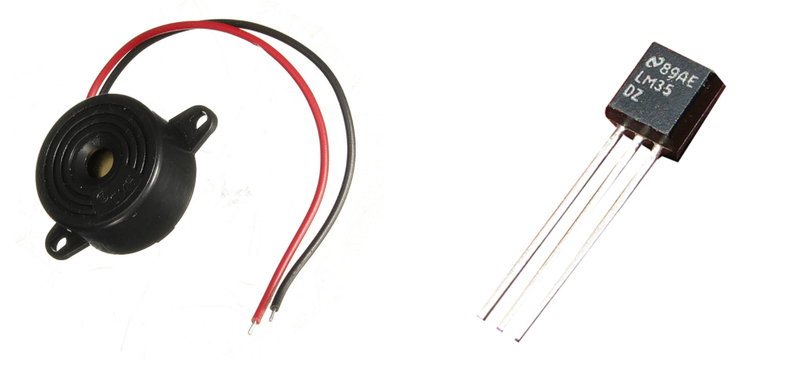
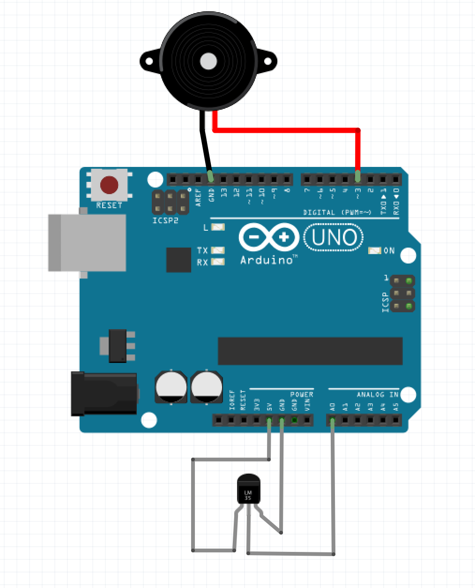
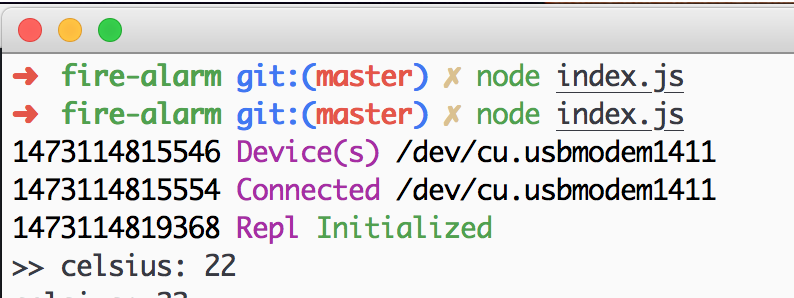
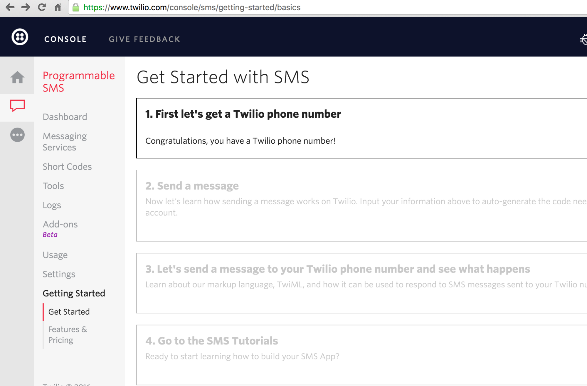
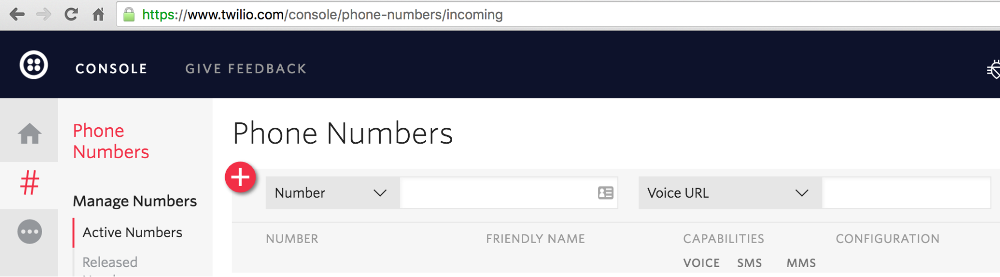

# Second project: Fire alarm

Our second example project will be that of an intelligent fire alarm. Our fire alarm will check for the temperature and, in the case of a fire, it will activate the audible alarm and send an SMS to the registered cell phone.

A simple example, but that shows some interesting integration points, such as integration with API's, data reading of a temperature sensor and integration with the Piezo sound sensor.


## Anatomy of a fire alarm

The project was based on a simple fire alarm home system. By default systems of this type do a check from time to time and activate the alarm some different temperature pattern is encountered.

## Materials needed

For this project we will use:

- 1 Protoboard: A protoboard is nothing more than a plate with holes and conductive connections for mounting of experimental electrical circuits, without the need of welding;
- 1 Piezo alarm sensor: It will be used for sound feedback to the end user, in our case to the tenant (s) of the property. This sensor is very simple and costs less than $ 2.00 can be found in any electric store;
- 1 temperature sensor: Johnny-Five works with a wide range of temperature sensors. In this case, we will use the LM35 temperature sensor. This sensor is very simple and costs less than $ 1.50 can be found in any electric store;



* For a complete list of supported sensors, go to [Johnny's Temperature Sensor Wiki](https://github.com/rwaldron/johnny-five/wiki/thermometer) page and check the list of sensor reference codes.

Some sensors require a specific voltage port for their correct operation (some sensors call VND). In our case we will use a 5 volt port for the temperature sensor.

Other sensors may need an analog port. Analog ports are used for the sensor to send voltage data to the Arduino so we can read and interpret your information.

For this project we will mount the sensors in the Arduino as follows:

- Piezo alarm sensor: Attach the black piezo wire to the GND port and the red wire to our arduino's number 3 port;
- LM35 temperature sensor: attach the grounding pin to the GND port, the voltage pin on the 5-volt port and the data output pin on the analog port "A0";

The following image illustrates the assembly of the integrated components with the Arduino.




## Controlling the Flame Sensor

With the LM35 sensor connected to the Arduino board, let's now read the ambient temperature information. For this we will use the Thermometer class of Johnny five. When we create a new object Thermometer, we must pay attention to some parameters:

- `controller`: Name of the sensor used. You can refer to the complete list of sensors supported by Johnny Five in the [Thermometer class documentation](https://github.com/rwaldron/johnny-five/wiki/thermometer);
- `pin`: The pin information used for the analog connection on the Arduino. It is used in analog sensors for reading the temperature information;
- `toCelsius`: An optional method that we can rewrite to handle the analog data and transform it into the temperature format of your preference. In our case, we will use the Celsius format;

Based on this information, the main file of our fire alarm will be:

```javascript
var five = require('johnny-five');
var board = new five.Board();

function FireAlarm() {
  return new five.Thermometer({
    controller: "LM35",
    pin: "A0"
  });
};

board.on("ready", function() {
  var temperatureSensor = new FireAlarm();

  setInterval(function() {
    console.log("celsius: %d", temperatureSensor.celsius);
  });
});
```

Let's then validate the functionality of our code with the Arduino platform. Inside the folder of our project, we will enter in our command line/prompt/terminal the following command:

```bash
$ node src/index.js
```

And this will be the result of our code.



The code is quite simple, as you can see. In the next topic, we will think a little more about our architecture and how to evolve this code for something easier to maintain.


## Evolving our initial code

Our initial code is functional, but evolving this code to the next steps is somewhat complex. To facilitate the next steps of our project, we will make some adjustments in our initial code.

You may notice that we have several configurations, such as the `controller` name and` pin` of the sensor. To improve the handling of these settings that are constant, that is, they do not change throughout the life of our application, we will add them in a file with our specific settings.

This will be added to our `src/configuration.js` file.

```javascript
// src/configuration.js
module.exports = {
  FIRE_ALARM: {
    // https://github.com/rwaldron/johnny-five/wiki/thermometer
    CONTROLLER: "LM35",
    PIN: 'A0'
  },
  INTERVAL: 1000
};
```

This is the contents of our `src/fire-alarm.js` file. Notice that we are now invoking the external configuration code and adding the values in the `CONFIG` variable. This step is interesting because we unlink the basic settings of our class project, which now has the responsibility of dealing with the sensors of the `fire alarm` project.

```javascript
// src/fire-alarm.js
var CONFIG = require('./configuration');
var five = require('johnny-five');
var intervalId = null;

function FireAlarm() {
  this.temperatureSensor = new five.Thermometer({
    controller: CONFIG.FIRE_ALARM.CONTROLLER,
    pin: CONFIG.FIRE_ALARM.PIN
  });
};

FireAlarm.prototype.stopPolling = function() {
  clearInterval(intervalId);
};

FireAlarm.prototype.startPolling = function() {
  self = this;
  intervalId = setInterval(function() {
    console.log('celsius: %d', self.temperatureSensor.celsius);
  }, CONFIG.INTERVAL);
};

module.exports = FireAlarm;
```

And our main `src/index.js` file will have a simpler content, having the responsibility of initiating the project and polling the` FireAlarm` class instance.

```javascript
// src/index.js
var FireAlarm = require('./fire-alarm');
var five = require('johnny-five');
var board = new five.Board();

board.on('ready', function() {
  fireAlarm = new FireAlarm();
  fireAlarm.startPolling();
});
```

When we run our code from the command, we will see the same result at our command line/prompt.

```bash
$ npm start
```

With these changes, we have a code of easy maintenance and much more readability to be used in our application. Of course, this is one of the several approaches that can be used in your project, but the focus of this topic is to pass on the idea of always thinking about how to improve our project.


## Integrating with Piezo for audible warning

Twilio is a service that allows developers to embed voice, *VoIP* and SMS messages into applications from a RESTful API that provides the voice and SMS capabilities for applications.

The alarm sensor we are going to use is Piezo because it is a simple component to handle and quite cheap, having its value around $ 1.00.

The integration of Piezo into our project is somewhat trivial since Johnny Five already has the `five.Piezo` class.

```javascript
...
this.piezo = new five.Piezo(3);
...
```

This class accepts the pin number that is bound to the sensor and when activating we have the `play` method, which accepts an object with the information:

- `time`: interval between each note;
- `song`: array that accepts arrays of 2 positions with the information of musical note and the time;

You can see an example of the play method being used in the code below.

```javascript
self.piezo.play({
  song: [
    ['G5', 1/4]
  ],
  tempo: 200
});
```

In our project, we are going to make the integration divided into 2 parts. First, we will add the piezo instance in the constructor of our class so that the piezo is accessible in the other methods.

```javascript
...
function FireAlarm() {
  this.piezo = new five.Piezo(3);
  ...
}
...
```

With our instance added and accessible, let's use it in our `startPolling` method. Let's add another validation by accessing the `piezo.isPlaying` boolean that contains the piezo initialization information in our project and, if the temperature is over the threshold and the piezo is accessible, we will trigger our audible alarm. With this, the method will remain as the following code.

```javascript
...
FireAlarm.prototype.startPolling = function() {
  self = this;
  intervalId = setInterval(function() {
    if (self.temperatureSensor.celsius >= CONFIG.FIRE_ALARM.LIMIT && !self.piezo.isPlaying) {
      self.piezo.play({
        song: [
          ['G5', 1/4],
          [null, 7/4]
        ],
        tempo: 200
      });
      console.log('Up to the limit:', self.temperatureSensor.celsius);
    } else {
      console.log('That\'s ok:', self.temperatureSensor.celsius);
    }
  }, CONFIG.INTERVAL);
};
...
```

Our final `FireAlarm` code will contain the following content:

```javascript
var CONFIG = require('./configuration');
var request = require('request');
var five = require('johnny-five');
var intervalId = null;

function FireAlarm() {
  this.piezo = new five.Piezo(3);
  this.temperatureSensor = new five.Thermometer({
    pin: CONFIG.FIRE_ALARM.PIN
  });
};


FireAlarm.prototype.stopPolling = function() {
  clearInterval(intervalId);
};

FireAlarm.prototype.startPolling = function() {
  self = this;
  intervalId = setInterval(function() {
    if (self.temperatureSensor.celsius >= CONFIG.FIRE_ALARM.LIMIT && !self.piezo.isPlaying) {

      self.piezo.play({
        song: [
          ['G5', 1/4],
          [null, 7/4]
        ],
        tempo: 200
      });

      console.log('Up to the limit:', self.temperatureSensor.celsius);
    } else {
      console.log('That\'s ok:', self.temperatureSensor.celsius);
    }

  }, CONFIG.INTERVAL);
};

module.exports = FireAlarm;
```

With this, we have the first feedback for the users of our application. The next step will be to add the SMS sending functionality using the Twilio API.


## Sending SMS to your phone using Twilio

Twilio is a service that allows developers to incorporate voice, VoIP and SMS messaging into applications from a RESTful API that provides voice and SMS capabilities to applications. Client libraries are available in multiple languages ​​and, of course, have a client for NodeJS called [twilio-node](https://twilio.github.io/twilio-node).

Integrating SMS into our application will be very simple. We go to the site to Twilio and we will enable the SMS service.



It has some paid numbers if you really want to use some product. In our case, we will use the number generated by the service itself and create a trial account on the platform.



Now, with Twilio set up, let's start integrating with our fire alarm. First let's add the phone information, SSID of your account, and Twilio's authentication token. Let's add this information in our `src/configuration.js`.

```javascript
module.exports = {
     LIMIT: 30,
     PIN: 'A0',
     PHONE_NUMBER: ''
  },
  TWILIO: {
    PHONE_NUMBER: '',
    ACCOUNT_SSID: '',
    AUTH_TOKEN: ''
  },
  INTERVAL: 1000
};
```

And let's continue with the integration of Twilio into our code by accessing and reading the information added in the `src/configuration.js` file with the Twilio node package.

```javascript
// fire-alarm.js

var CONFIG = require('./configuration');
var request = require('request');
var five = require('johnny-five');
var twilio = require('twilio');
var intervalId = null;

var client = new twilio.RestClient(CONFIG.TWILIO.ACCOUNT_SSID, CONFIG.TWILIO.AUTH_TOKEN);

function FireAlarm() {
  this.piezo = new five.Piezo(3);
  this.temperatureSensor = new five.Thermometer({
    pin: CONFIG.FIRE_ALARM.PIN
  });
};

FireAlarm.prototype.stopPolling = function() {
  clearInterval(intervalId);
};

FireAlarm.prototype.startPolling = function() {
  self = this;
  intervalId = setInterval(function() {
    if (self.temperatureSensor.celsius >= CONFIG.FIRE_ALARM.LIMIT && !self.piezo.isPlaying) {

      self.piezo.play({
        song: [
          ['G5', 1/4],
          [null, 7/4]
        ],
        tempo: 200
      });

      client.messages.create({
        body: 'Something is wrong with your fire alarm. Please, call the local fire brigade.',
        to: CONFIG.FIRE_ALARM.PHONE_NUMBER,
        from: CONFIG.TWILIO.PHONE_NUMBER
      });

      console.log('Up to the limit:', self.temperatureSensor.celsius);
    } else {
      console.log('That\'s ok:', self.temperatureSensor.celsius);
    }
  }, CONFIG.INTERVAL);
};

module.exports = FireAlarm;
```

Let's now run our code by typing the command npm start and this will be the information printed at our prompt/command line.

When we execute our code and the temperature exceeds the configured limit, in addition to the Piezo sensor that will trigger the alarm our customer of Twilio will be activated and will send us an SMS using the previously added configurations. Then you will receive the following message on your cell phone.


With this we have seen the complete integration of our Fire Alarm. Of course, this is the first step, you can evolve the code and add new features. As we already know: the sky is the limit!

But what about the unit tests? We know it's working, but we have to make sure the code has an acceptable level of quality even to evolve our project and add new features. Let's now create our unit tests.


### Creating unit tests for Fire Alarm

As commented on in the "Building unit tests for build checker" content, unit testing is just one of several ways to test your software and have reliability in the final product with some automatic validations before deploying our project to production.

Let's now create a folder for our unit tests with the name test. By default, we will instantiate the [MochaJS]test framework (https://mochajs.org), [SinonJS](http://sinonjs.org) for *spies*, *stubs* and *mocks* and [ShouldJS](https://shouldjs.github.io) for *assertions*. Let's then install these packages as a dependency of project development.

```bash
$ mkdir test
$ npm install --save-dev mocha sinon should
```

For our tests, we will reuse the contents of `test/spec-helper.js` and` test/mocha.opts` that we created for our build checker project. It uses the [mock-Firmata package](https://github.com/rwaldron/mock-firmata) to setup the tests in our Johnny-Five application.

```javascript
//test/spec-helper.js
require('should');
var mockFirmata = require('mock-firmata');
var five = require('johnny-five');

var board = new five.Board({
  io: new mockFirmata.Firmata(),
  debug: false,
  repl: false
});
```

And this will be the initial content of our `mocha.opts`.

```bash
--reporter spec
--recursive
--require test/spec-helper.js
--slow 1000
--timeout 5000
```

A quick explanation of the configuration information used:

`--reporter spec`: The type of reporter used to display the test information messages;
`--recursive`: flag to identify that the tests should run recursively within the folder;
`--require test/spec-helper.js`: setup file to be loaded before running the unit tests;
`--low 1000`: Maximum time in milliseconds of tolerance between tests. If this time exceeds this time will be shown the total time of that test with a differentiated colour so that we can make the necessary changes;
`--timeout 5000`: Maximum time in milliseconds of tolerance for the completion of each assertion. If this time exceeds this time our tests will return with an error message;

Now, let's create the scenarios for our tests. Let us then define the scenarios that we must cover in our tests:

- Initial application settings;
- Initial information when creating the instance of `FireAlarm`;
- When we start the polling and the sensor signals that the temperature is within the acceptable limit;
- When we start the polling and the sensor signals that the temperature is above the acceptable limit;
- When the piezo sensor is activated;
- When the Twilio SMS API is triggered;

One way to validate when the fire alarm should trigger the audible alarm is to create a *stub* for trigger and use some *spies* for the Twilio API.

As a first step, we will create the tests of our configuration file, which we will divide between the temperature sensor information and the Twilio API. We will make the request for our `src/configuration.js` and we will check the information of the pin to be connected to the sensor, the value of the interval to be used to check the sensor information and the acceptable temperature limit of the environment in which` FireAlarm` will be working and your phone will be set to receive SMS.

```javascript
var CONFIG = require('../src/configuration');

describe('Configuration', function() {

  describe('Temperature information', function() {

    it('should have the sensor port configured', function(){
      CONFIG.FIRE_ALARM.should.have.property('PIN').which.is.a.String()
    });

    it('should have the sensor alarm limit configured', function(){
      CONFIG.FIRE_ALARM.should.have.property('LIMIT').which.is.a.Number()
    });

    it('should have the user phone configured', function(){
      CONFIG.FIRE_ALARM.should.have.property('PHONE_NUMBER').which.is.a.String()
    });
  });
});
```

Now we evaluate the information that will be passed to Twilio, which in our case will be the SSID key, authentication token and the telephone number provided by Twilio.

```javascript
  ...
  describe('SMS information', function() {

    it('should have account ssid configured', function(){
      CONFIG.TWILIO.should.have.property('ACCOUNT_SSID').which.is.a.String()
    });

    it('should have auth token configured', function(){
    CONFIG.TWILIO.should.have.property('AUTH_TOKEN').which.is.a.String()
    });

    it('should have the user phone configured', function(){
      CONFIG.TWILIO.should.have.property('PHONE_NUMBER').which.is.a.String()
    });
  });
  ...
```

Our `src/configuration.js` test file will look like this.

```javascript
var CONFIG = require('../src/configuration');

describe('Configuration', function() {

  describe('Temperature information', function() {

    it('should have the sensor port configured', function(){
      CONFIG.FIRE_ALARM.should.have.property('PIN').which.is.a.String()
    });

    it('should have the sensor alarm limit configured', function(){
      CONFIG.FIRE_ALARM.should.have.property('LIMIT').which.is.a.Number()
    });

    it('should have the user phone configured', function(){
      CONFIG.FIRE_ALARM.should.have.property('PHONE_NUMBER').which.is.a.String()
    });
  });

  describe('SMS information', function() {

    it('should have account ssid configured', function(){
      CONFIG.TWILIO.should.have.property('ACCOUNT_SSID').which.is.a.String()
    });

    it('should have auth token configured', function(){
      CONFIG.TWILIO.should.have.property('AUTH_TOKEN').which.is.a.String()
    });

    it('should have the user phone configured', function(){
      CONFIG.TWILIO.should.have.property('PHONE_NUMBER').which.is.a.String()
    });
  });

  it('should have the interval polling information', function(){
    CONFIG.should.have.property('INTERVAL').which.is.a.Number()
  });

});
```

Let's then create the scenario to validate the code of our `FireAlarm`. One of the things we should keep in mind about our unit testing framework is that its `beforeEach` method, which happens before each` it` method, is going to be used as documentation for playback of each specific scenario.

Let's then explain more about the contents of this file and why of each test. We create the tests of the instance of our `FireAlarm` and its initial attributes.

```javascript
var proxyquire = require('proxyquire');
var CONFIG = require('../src/configuration');
var five = require('johnny-five');
var request = require('request');
var sinon = require('sinon');

describe('FireAlarm', function() {

  beforeEach(function(){
    this.sandbox = sinon.sandbox.create();
    this.createMessagesSpy = this.sandbox.spy();
    var restClientMessage = {
      messages: {
        create: this.createMessagesSpy
      }
    };

    twilioMock = {
      RestClient: function() {
        return restClientMessage
      }
    };

    var FireAlarm = proxyquire('../src/fire-alarm', {
      twilio: twilioMock
    });
    fireAlarm = new FireAlarm();
  });

  afterEach(function() {
    this.sandbox.restore();
  });

  it('should have the termometer sensor configured', function(){
    (fireAlarm.temperatureSensor instanceof five.Thermometer).should.be.equal(true);
  });

});
```

Let's validate when we stop our *polling*. Let's now use the `spy` method of the sinon to check if the code used the` clearInterval` method to end with the requests. For this, we will check if the `global.clearInterval` was used once, by accessing the boolean `calledOnce`, which is an internal counter added by the `sinon.spy` method for the tests.

```javascript
  ...
  describe('#stopPolling', function(){
    beforeEach(function(){
      this.sandbox.spy(global, 'clearInterval');
      fireAlarm.stopPolling();
    });

    it('should remove interval', function(){
      global.clearInterval.calledOnce.should.be.true;
    });
  });
  ...
```

And now the scenarios that happen when the sensor is started. For this, we will assign some spies for the setInterval functions and for the piezo sensor. Our first validation will be to certify that the range is being started when we call the `fireAlarm.startPolling()` method.

```javascript
  ...
  describe('#startPolling', function(){
    beforeEach(function(){
      this.piezoPlaySpy = this.sandbox.spy();

      var piezoStub = {
        isPlaying: false,
        play: this.piezoPlaySpy
      };
      this.sandbox.stub(fireAlarm, 'piezo', piezoStub);

      this.sandbox.spy(global, 'setInterval');
      fireAlarm.startPolling();
    });

    afterEach(function(){
      global.setInterval.restore();
    });

    it('should creates polling', function(){
      global.setInterval.calledOnce.should.be.true;
    });
  });
  ...
```

To validate the temperature case above the limit we will use the `clock.tick` method with the information contained in the configuration file, simulating the time and time changes at the time of the test, which helps us to force the event Polling, which uses `setInterval`.

In this scenario we use the `stub` to simulate the return of the sensor with a value above the acceptable and we make sure that the Piezo sensor and the Apollo of Twilio were triggered.

```javascript
    ...
    describe('When the temperature is up to the limit', function(){

      beforeEach(function() {
        clock = this.sandbox.useFakeTimers();

        this.sandbox.stub(fireAlarm, 'temperatureSensor', {
          celsius: CONFIG.FIRE_ALARM.LIMIT + 1
        });
        fireAlarm.startPolling();
        clock.tick(CONFIG.INTERVAL);
      });

      afterEach(function(){
        clock.restore();
      });

      it('should trigger piezo sensor alarm', function(){
        this.piezoPlaySpy.calledOnce.should.be.true;
      });

      it('should send the SMS to user', function() {
        this.createMessagesSpy.calledOnce.should.be.true;
      });

    });
    ...
```

Now we will validate the ambient temperature scenario in acceptable levels. The checks use the same approaches as the previous one, but in this case, we make sure that the piezo sensor and the Twilio API **were not triggered**.

```javascript
    ...
    describe('When the temperature is NOT up to the limit', function(){


      beforeEach(function() {
        clock = this.sandbox.useFakeTimers();


        this.sandbox.stub(fireAlarm, 'temperatureSensor', {
          celsius: CONFIG.FIRE_ALARM.LIMIT - 1
        });


        fireAlarm.startPolling();
        clock.tick(CONFIG.INTERVAL);
      });


      afterEach(function(){
        clock.restore();
      });


      it('should NOT trigger piezo sensor alarm', function(){
        this.piezoPlaySpy.calledOnce.should.be.false;
      });


      it('should NOT send the SMS to user', function() {
        this.createMessagesSpy.calledOnce.should.be.false;
      });


    });
    ...
```

Based on our test scenarios, this is the test content of our fire alarm file:

```javascript
var proxyquire = require('proxyquire');
var CONFIG = require('../src/configuration');
var five = require('johnny-five');
var request = require('request');
var sinon = require('sinon');

describe('FireAlarm', function() {

  beforeEach(function(){
    this.sandbox = sinon.sandbox.create();
    this.createMessagesSpy = this.sandbox.spy();
    var restClientMessage = {
      messages: {
        create: this.createMessagesSpy
      }
    };

    twilioMock = {
      RestClient: function() {
        return restClientMessage
      }
    };

    var FireAlarm = proxyquire('../src/fire-alarm', {
      twilio: twilioMock
    });
    fireAlarm = new FireAlarm();
  });

  afterEach(function() {
    this.sandbox.restore();
  });

  it('should have the termometer sensor configured', function(){
    (fireAlarm.temperatureSensor instanceof five.Thermometer).should.be.equal(true);
  });

  describe('#stopPolling', function(){
    beforeEach(function(){
      this.sandbox.spy(global, 'clearInterval');
      fireAlarm.stopPolling();
    });

    it('should remove interval', function(){
      global.clearInterval.calledOnce.should.be.true;
    });
  });

  describe('#startPolling', function(){
    beforeEach(function(){
      this.piezoPlaySpy = this.sandbox.spy();

      var piezoStub = {
        isPlaying: false,
        play: this.piezoPlaySpy
      };
      this.sandbox.stub(fireAlarm, 'piezo', piezoStub);

      this.sandbox.spy(global, 'setInterval');
      fireAlarm.startPolling();
    });

    afterEach(function(){
      global.setInterval.restore();
    });

    it('should creates polling', function(){
      global.setInterval.calledOnce.should.be.true;
    });

    describe('When the temperature is up to the limit', function(){

      beforeEach(function() {
        clock = this.sandbox.useFakeTimers();

        this.sandbox.stub(fireAlarm, 'temperatureSensor', {
          celsius: CONFIG.FIRE_ALARM.LIMIT + 1
        });
        fireAlarm.startPolling();
        clock.tick(CONFIG.INTERVAL);
      });

      afterEach(function(){
        clock.restore();
      });

      it('should trigger piezo sensor alarm', function(){
        this.piezoPlaySpy.calledOnce.should.be.true;
      });

      it('should send the SMS to user', function() {
        this.createMessagesSpy.calledOnce.should.be.true;
      });

    });

    describe('When the temperature is NOT up to the limit', function(){

      beforeEach(function() {
        clock = this.sandbox.useFakeTimers();

        this.sandbox.stub(fireAlarm, 'temperatureSensor', {
          celsius: CONFIG.FIRE_ALARM.LIMIT - 1
        });

        fireAlarm.startPolling();
        clock.tick(CONFIG.INTERVAL);
      });

      afterEach(function(){
        clock.restore();
      });

      it('should NOT trigger piezo sensor alarm', function(){
        this.piezoPlaySpy.calledOnce.should.be.false;
      });

      it('should NOT send the SMS to user', function() {
        this.createMessagesSpy.calledOnce.should.be.false;
      });
    });
  });
});
```

With that we finished our first project with unit tests, covering all our possible scenarios. In the next chapter, we'll look at other services that make life easier for us by sending the code to production, such as seamless integration servers, code coverage, and complexity in an automated way.
